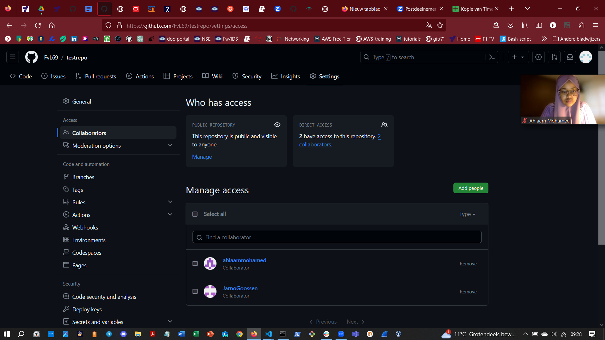

## GIT , GITHUB:

Git is open-source en gratis te gebruiken. Het is het meest gebruikte versiebeheer systeem
op het moment van schrijven. Dit is mede doordat Git projecten van alle formaten aankan.

Github is een Git hosting service in de cloud van Microsoft. Github laat je Git repositories hosten en managen. 

Wat is het verschil tussen GIT en GitHub?

Git is een systeem voor versiebeheer, dat wil zeggen een systeem om oudere versies van je project op een ordelijke manier bij te houden in de vorm van snapshots. Git word gebruikt middels een CLI of GUI op de lokale harde schijf.

GitHub is een webgebaseerd platform met git's versiecontrolefuncties, zodat ze in samenwerkingsverband kunnen worden gebruikt.

## KEY-TERMS:
* Repository = lokale opslagplaats
* Main / Master = de eerste 'branch', startpunt van de tijdlijn
* Branch = een onafhankelijke aftakking van de hoofd tijdlijn (master/main)
* Commit = maakt een nieuwe wijziging in de tijdlijn vergezelt van een betekenisvolle omschrijving 
* Push / Pull = updates doorsturen naar een remote(van Git naar een Github repo) / wijzigingen gemaakt in een remote integreren in jou repository
* Merge = 2 branches samenvoegen
* Fork = 

## GEBRUIKTE BRONNEN:

[git learn link](https://apwt.gitbook.io/leerlijn-git/)

[git-push-pull-tu](https://www.datacamp.com/tutorial/git-push-pull)

[git-bash-cmds](https://dev.classmethod.jp/articles/git-bash-commands/)

## ERVAREN PROBLEMEN:

Ik heb mijn versie van Git verwijderd en opnieuw geïnstalleerd omdat ik problemen had met git push commando. Ik heb in de configuratie van Git voor de cmd(windows) CLI gekozen en daarna werkte het wel naar behoren.

## RESULTAAT:

**Opdracht 1:**
* Maak een GitHub account als je er nog geen hebt
  Ik had al een bestaand account.

   

* Maak een repository op je GitHub account voor je portfolio

  

* Geef permissies aan je teamgenoten om de repository te gebruiken

  

* Push je code naar je repository

 test.txt

  

* Pull / Clone een repository van je peer.

  

**Opdracht 2:**
* Maak een nieuwe repository aan voor je portfolio

  

* Push je notities naar de repository

  
  
* Deel deze repository met je Learning Coach
