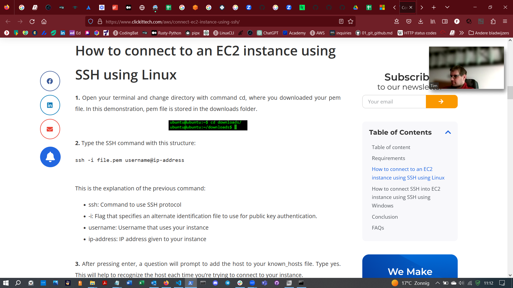
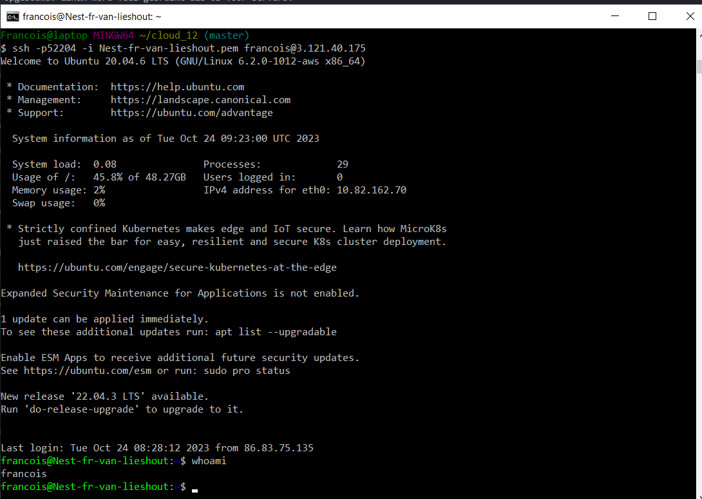

## LINUX-1 SETTING UP:

Linux is een besturingssysteem, zoals Windows, maar is open-source en kent geen geheimen. 
Je hebt toegang tot alle files en dirs en daardoor erg leerzaam in het ontdekken van hoe het 
systeem is opgebouwd. Linux word veel gebruikt als OS voor servers.

## KEY-TERMS:

UBUNTU = een Linux distributie

AWS = Amazon Web Services, cloud provider waar de VM in draait.

VM (virtual machine) = met software opgebouwde hardware, werkt zoals een fysieke PC 

CLI (command line interface) = applicatie voor de communicatie tussen hardware en OS

SSH (secure shell) = protocol om op een versleutelde manier op een remote computer of  
server in te loggen.

## OPDRACHT:

* Make an SSH-connection to your virtual machine. SSH requires the key file to have
  specific permissions, so you might need to change those.
* When the connection is successful, type whoami in the terminal. This command
  should show your username.

## GEBRUIKTE BRONNEN:

[connect ec2 instance ssh](https://www.clickittech.com/aws/connect-ec2-instance-using-ssh/)

## ERVAREN PROBLEMEN:
De in de beschrijving gegeven link naar OpenSSH voor Windows vond ik niet helder. 

## RESULTAAT:

**Inloggen bij AWS Linux server in Git Bash:**
ssh -p52204 -i Nest-fr-van-lieshout.pem francois@3.121.40.175
