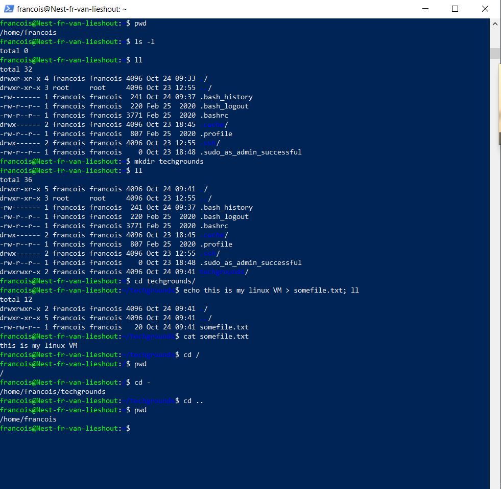

## LINUX-02 FILES & DIRECTORIES:

Het Linux file systeem is een omgekeerde boom. Het start bij / (root) en breidt
zich verder naar beneden uit met directories die files en subdirectories bevatten enz...

## KEY-TERMS:

Root = het begin van het file systeem

**commands:**

MKDIR = creëer een nieuwe directory

TOUCH = creëer een nieuwe file

CD = change directory

CAT = concatenate file 

PWD = present working directory

## OPDRACHT:

**Exercise:**
* Find out your current working directory.
* Make a listing of all files and directories in your home directory.
* Within your home directory, create a new directory named ‘techgrounds’.
* Within the techgrounds directory, create a file containing some text.
* Move around your directory tree using both absolute and relative paths.

## ERVAREN PROBLEMEN:
Geen.

## RESULTAAT:

