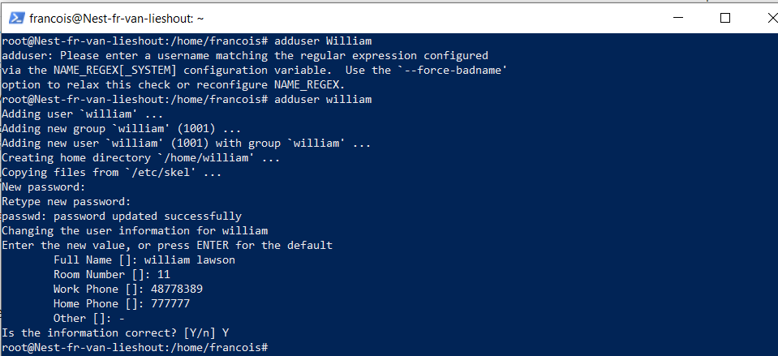
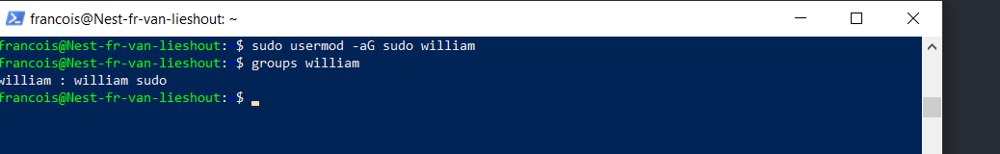
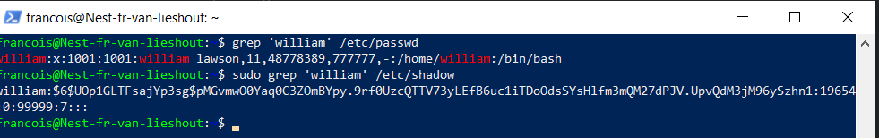

## USERS AND GROUPS:

There are two kinds of users in Linux: the root user and the regular user.  
The root user is the system administrator and has access to the whole   
system. The regular user has only limited access to his own account and files  
created. It is possible for a regular user to get admin priviliges (sudo priviliges)  
from the sys admin (root user) if needed. All users are also part of user groups.  

## KEY-TERMS:

adduser = command to add a new user

sudo = command for non-root user with admin priviliges

usermod -aG sudo = is the command for adding a user to the sudo group

pipeline "|" = used to 'pipe' the output of one command into another

grep = command to find patterns in a file, e.g. a name you want to find in a large file.

## OPDRACHT:

**Create a new user in your VM:**
* Give the user a password
* Make the new user part of the admin group
* Show that the user can use **sudo**

**Show the files that store password, users and groups**
* Show the new user in those files

## GEBRUIKTE BRONNEN:

[Add-User-LNX](https://www.digitalocean.com/community/tutorials/how-to-add-and-delete-users-on-ubuntu-20-04)

## EVAREN PROBLEMEN:

geen

## RESULTAAT:

### Adding a User:

If you are signed in as the _**root user**_, you can create a new user at any time by running the following
command: **adduser 'newusername'**

If you're _**not the root user**_ but a user with admin priviliges use the sudo command:

**sudo adduser 'newusername'**

* Assign and confirm a password for the new user.
* Enter any additional information about the new user. (optional)
* If the provided information is correct, press Y to continue.

### Granting a User Sudo Privileges:

Enter following command: **sudo usermod -aG sudo 'username'**

### Show the new user in the passwd and shadow files:

**I've used the grep command to filter out the user from the files.**

