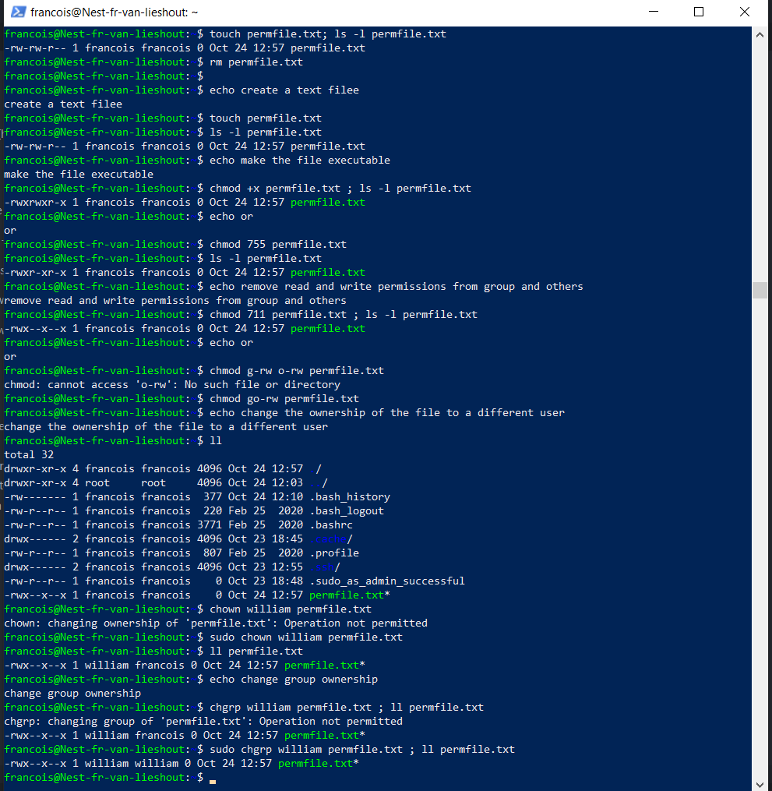

## FILE PERMISSIONS:

Understanding Linux file permissions (how to find them, read them, and change them) is an important part of maintaining and securing your systems.

## KEY-TERMS:

**touch** = command to create a new file

**ls -l** = command with long listing flag -l to list files or dirs

**chmod** = command to change permissions of a file or dir

**chown** = command to change user ownership of a file or dir

**chgrp** = command to change group ownership of a file or dir

## OPDRACHT:

* Create a text file
* Make a long listing to view the file permissions
* Make the file executable
* Remove read and write permissions from group and others
* Change the ownership of the file to a different user
* Change the group ownership to a different group

## GEBRUIKTE BRONNEN:

[FilePermissions](https://www.redhat.com/sysadmin/linux-file-permissions-explained)

## ERVAREN PROBLEMEN:

geen

## RESULTAAT:

