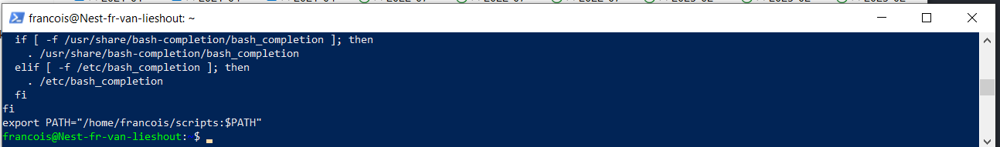

## BASH SCRIPTING:

A BASH script is a file containing a series of commands. The shell  
reads this file and carries out the commands as though they have been   
entered directly on the command line.  

To successfully create and run a shell script, we need to do three things:
* Write a script. 
* Make the script executable.
* Put the script somewhere the shell can find it.

## KEY-TERMS

* **BASH** = Bourne Again Shell, the LINUX/UNIX CLI (command line interface)
* **nano** = text editor (to write the script)
* **export PATH="path-to-your-dir:$PATH"** = command used to set the environmental variable $PATH to the dir where the executable file resides
* **HTTPd** = Apaches Hyper Text Transfer Protocol deamon
* **script** = Scripting allows for an automatic commands execution 

## ASSIGNMENT:

### Exercise 1
* Create a directory called 'scripts'
* Add scripts dir to $PATH
* Create a script that appends a line of text to a text file
* Create a script that installs the httpd package, activates httpd and enables httpd
* Finally, your script prints the status of httpd to the terminal

### Exercise 2
* Create a script that generates a random number between 1 and 10.
* Stores it in a variable and appends it to a text file.

### Execise 3
* Create a script that generates a random number between 1 and 10.
* Stores it in a variable and appends it to a text file if the number is bigger than 5.
* The script appends a line of text if the number is less than or equal to 5.

## USED RESOURCES:

[LNX-scripting](https://linuxconfig.org/bash-scripting-tutorial-for-beginners)

[LNX-appnd](https://linuxhint.com/bash_append_line_to_file/)

[Apache-Install](https://www.digitalocean.com/community/tutorials/how-to-install-the-apache-web-server-on-ubuntu-20-04#step-3-checking-your-web-server)

[Init-server-setup](https://www.digitalocean.com/community/tutorials/initial-server-setup-with-ubuntu-20-04)

[Random_num](https://linuxhint.com/generate-random-number-bash/)

## DIFFICULTIES:
None

## Exercise 1:

### Creating scripts directory
*mkdir scripts*

### Add scripts dir to $PATH permanently by adding it to the .bashrc file
### Add export PATH="your-dir:$PATH" to the last line of the file, where your-dir is the directory you want to add.

### This script takes any text file as positional parameter in which you want to append text.

### The script code in nano

### Installed, activated and enabled apache2 by bash script.

## Exercise 2:

### Creating a script that produces a random number stored in a variable and append it to a file.

## Exercise 3:

### Create a script that generates a random number between 1 and 10.
### Stores it in a variable and appends it to a text file if the number is bigger than 5.
### The script appends a line of text if the number is less than or equal to 5.

