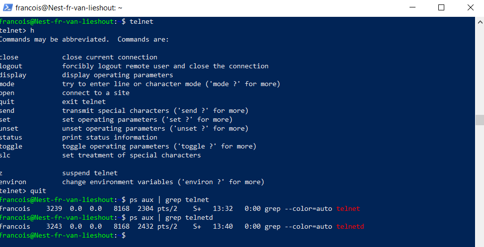

## PROCESSES:

Processes are instances of running code. 

There are 3 categories of processes in linux:
* Deamons (non-interactive)
* services (may be interactive)
* programs (interactive)

## KEY-TERMS:

**Telnet** = Protocol for connecting to a remote computer (not encrypted)

**Process** = running code

**PID** = process id

**%MEM** = percentage memory usage

**Deamon** = process running in the background

**Kill** = send a signal to a process

## ASSIGNMENT:

* Start the telnet deamon
* Find out the telnet PID
* Find out how much memory telnet is using
* Kill the telnetd process 

## USED RESOURCES:

[Telnet_src](https://www.javatpoint.com/linux-telnet-command)

## DIFFICULTIES:

none really

## RESULT:

**Starting the telnet deamon with the telnet command:**

**Finding out the telnetd PID by using the command: ps -aux | grep telnetd**

The PID is: **3243**

%MEM is: **0.0**

Killing the telnetd deamon process is not possible, a deamon can't be interacted with.

