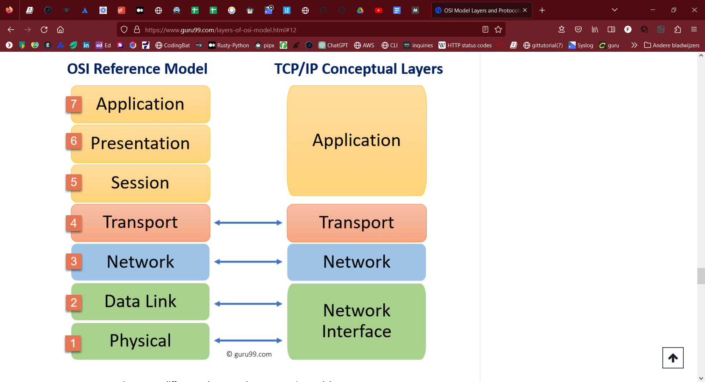
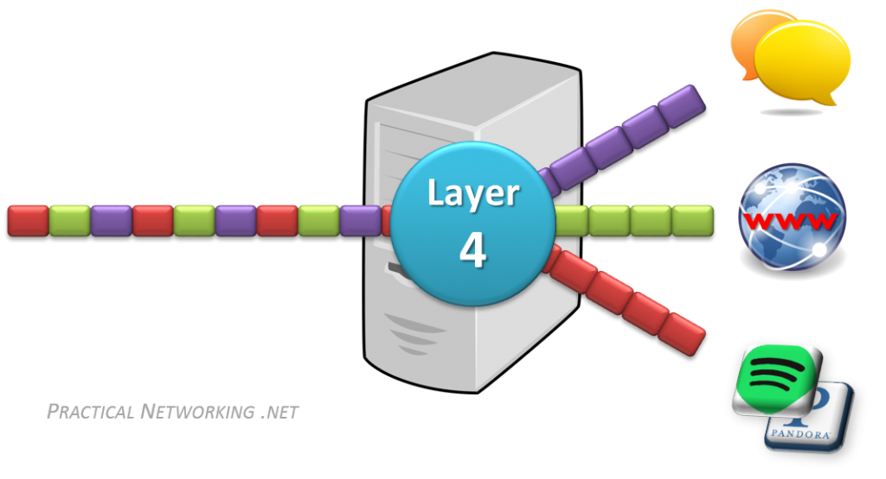
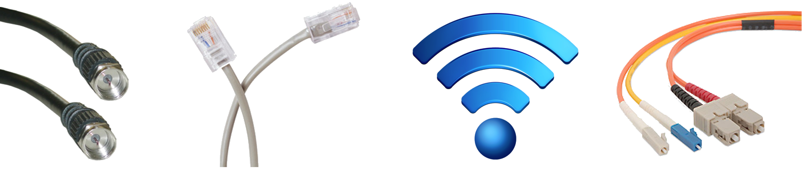

## THE OSI MODEL:

The OSI Model is a logical and conceptual model that defines network communication used by systems open to interconnection  
and communication with other systems. The Open System Interconnection (OSI Model) also defines a logical network and effectively  
describes computer packet transfer by using various layers of protocols.

## THE TCP/IP MODEL:

The TCP/IP protocol is divided into two layers: the Transport layer and the Internet layer.   
The Transport layer is responsible for ensuring that data is transmitted reliably from one device to another.   
This layer is comprised of two protocols: the Transmission Control Protocol (TCP) and the User Datagram Protocol (UDP).   
TCP is used for reliable data transmission, while UDP is used for fast transmission of data that can tolerate some packet loss.

The Internet layer is responsible for transmitting data packets between devices. This layer is comprised of   
two protocols: the Internet Protocol (IP) and the Address Resolution Protocol (ARP). IP is responsible for   
routing data packets between devices, while ARP is used to map IP addresses to physical addresses.

TCP/IP also includes a number of application layer protocols that are used to provide services to end-users.   
These include protocols such as HTTP (Hypertext Transfer Protocol) for web browsing, FTP (File Transfer Protocol)   
for file transfer, and SMTP (Simple Mail Transfer Protocol) for email.

## KEY-TERMS

* OSI model = Open Systems Interconnect model
* TCP/IP = Transmission Control Protocol / Internet Protocol
* UDP = User Datagram Protocol

## ASSIGNMENT:

### Study the OSI model.
### Study TCP/IP 

## USED RESOURCES:

[OSI-model](https://www.networkworld.com/article/3239677/the-osi-model-explained-and-how-to-easily-remember-its-7-layers.html)

[TCP/IP model](https://www.geeksforgeeks.org/tcp-ip-model/)

[OSI_TCP-IP](https://www.guru99.com/layers-of-osi-model.html#12)

[practical-networking-blog](https://www.practicalnetworking.net/series/packet-traveling/osi-model/)

## DIFFICULTIES:

The assignment covers a lot of information you need to grasp.

## RESULT:

## OSI model:

**The open system interconnection model or OSI model consists of 7 layers:**
* layer 7: application
* layer 6: presentation
* layer 5: session
* layer 4: transport
* layer 3: network
* layer 2: data link
* layer 1: physical

### Layer 7 - Application
The Application Layer in the OSI model is the layer that is the “closest to the end user”. It receives information directly from users and displays incoming data to the user. Oddly enough, applications themselves do not reside at the application layer. Instead the layer facilitates communication through lower layers in order to establish connections with applications at the other end. Web browsers (Google Chrome, Firefox, Safari, etc.) TelNet, and FTP, are examples of communications  that rely  on Layer 7.

### Layer 6 - Presentation
The Presentation Layer represents the area that is independent of data representation at the application layer. In general, it represents the preparation or translation of application format to network format, or from network formatting to application format. In other words, the layer “presents” data for the application or the network. A good example of this is encryption and decryption of data for secure transmission; this happens at Layer 6.

### Layer 5 - Session
When two computers or other networked devices need to speak with one another, a session needs to be created, and this is done at the Session Layer. Functions at this layer involve setup, coordination (how long should a system wait for a response, for example) and termination between the applications at each end of the session.

### Layer 4 – Transport
The Transport Layer deals with the coordination of the data transfer between end systems and hosts. How much data to send, at what rate, where it goes, etc. The best known example of the Transport Layer is the Transmission Control Protocol (TCP), which is built on top of the Internet Protocol (IP), commonly known as TCP/IP. TCP and UDP port numbers work at Layer 4, while IP addresses work at Layer 3, the Network Layer.

### Layer 3 - Network
Here at the Network Layer is where you’ll find most of the router functionality that most networking professionals care about and love. In its most basic sense, this layer is responsible for packet forwarding, including routing through different routers. You might know that your Boston computer wants to connect to a server in California, but there are millions of different paths to take. Routers at this layer help do this efficiently.

* Layer 2 uses MAC addresses and is responsible for packet delivery from hop to hop.
* Layer 3 uses IP addresses and is responsible for packet delivery from end to end.

### Layer 2 – Data Link
The Data Link Layer provides node-to-node data transfer (between two directly connected nodes), and also handles error correction from the physical layer. Two sublayers exist here as well--the Media Access Control (MAC) layer and the Logical Link Control layer. (LLC, provides conventional data link protocol functions, such as error control and flow control.) In the networking world, most switches operate at Layer 2. But it’s not that simple. Some switches also operate at Layer 3 in order to support virtual LANs that may span more than one switch subnet, which requires routing capabilities.

### Layer 1 - Physical
At the bottom of our OSI model we have the Physical Layer, which represents the electrical and physical representation of the system. This can include everything from the cable type, radio frequency link (as in a Wi-Fi network), as well as the layout of pins, voltages, and other physical requirements. When a networking problem occurs, many networking pros go right to the physical layer to check that all of the cables are properly connected and that the power plug hasn’t been pulled from the router, switch or computer, for example.

An easy way to remember these 7 layers:  
### A Priest Saw Two Nuns Doing Pushups

## TCP/IP PROTOCOL:

### What Does TCP/IP Do?

The main work of TCP/IP is to transfer the data of a computer from one device to another. The main condition of this process is to make data reliable and accurate so that the receiver will receive the same information which is sent by the sender. To ensure that, each message reaches its final destination accurately, the TCP/IP model divides its data into packets and combines them at the other end, which helps in maintaining the accuracy of the data while transferring from one end to another end.

### What is the Difference between TCP and IP?

TCP and IP are different protocols of Computer Networks. The basic difference between TCP (Transmission Control Protocol) and IP (Internet Protocol) is in the transmission of   data. In simple words, IP finds the destination of the mail and TCP has the work to send and receive the mail. UDP is another protocol, which does not require IP to communicate  with another computer. IP is required by only TCP. This is the basic difference between TCP and IP.  

## Protocols:
### Transport Layer 4:

The TCP/IP transport layer protocols exchange data receipt acknowledgments and retransmit missing packets to ensure that packets arrive in order and without error. End-to-end communication is referred to as such. Transmission Control Protocol (TCP) and User Datagram Protocol are transport layer protocols at this level (UDP).

TCP: Applications can interact with one another using TCP as though they were physically connected by a circuit. TCP transmits data in a way that resembles character-by-character transmission rather than separate packets. A starting point that establishes the connection, the whole transmission in byte order, and an ending point that closes the connection make up this transmission.
UDP: The datagram delivery service is provided by UDP, the other transport layer protocol. Connections between receiving and sending hosts are not verified by UDP. Applications that transport little amounts of data use UDP rather than TCP because it eliminates the processes of establishing and validating connections.

### Application Layer

This layer is analogous to the transport layer of the OSI model. It is responsible for end-to-end communication and error-free delivery of data. It shields the upper-layer applications from the complexities of data. The three main protocols present in this layer are:

HTTP and HTTPS: HTTP stands for Hypertext transfer protocol. It is used by the World Wide Web to manage communications between web browsers and servers. HTTPS stands for HTTP-Secure. It is a combination of HTTP with SSL(Secure Socket Layer). It is efficient in cases where the browser needs to fill out forms, sign in, authenticate, and carry out bank transactions.
SSH: SSH stands for Secure Shell. It is a terminal emulations software similar to Telnet. The reason SSH is preferred is because of its ability to maintain the encrypted connection. It sets up a secure session over a TCP/IP connection.
NTP: NTP stands for Network Time Protocol. It is used to synchronize the clocks on our computer to one standard time source. It is very useful in situations like bank transactions. Assume the following situation without the presence of NTP. Suppose you carry out a transaction, where your computer reads the time at 2:30 PM while the server records it at 2:28 PM. The server can crash very badly if it’s out of sync.

### Internet layer 3:

This layer parallels the functions of OSI’s Network layer. It defines the protocols which are responsible for the logical transmission of data over the entire network. The main protocols residing at this layer are as follows:

IP: IP stands for Internet Protocol and it is responsible for delivering packets from the source host to the destination host by looking at the IP addresses in the packet headers. IP has 2 versions: IPv4 and IPv6. IPv4 is the one that most websites are using currently. But IPv6 is growing as the number of IPv4 addresses is limited in number when compared to the number of users.
ICMP: ICMP stands for Internet Control Message Protocol. It is encapsulated within IP datagrams and is responsible for providing hosts with information about network problems.
ARP: ARP stands for Address Resolution Protocol. Its job is to find the hardware address of a host from a known IP address. ARP has several types: Reverse ARP, Proxy ARP, Gratuitous ARP, and Inverse ARP.

### Data Link Layer 2:

The packet’s network protocol type, in this case, TCP/IP, is identified by the data-link layer. Error prevention and “framing” are also provided by the data-link layer. Point-to-Point Protocol (PPP) framing and Ethernet IEEE 802.2 framing are two examples of data-link layer protocols.

###  Physical Layer 1:
Layer 1 is anything that carries 1’s and 0’s between two nodes.

The actual format of the data on the “wire” can vary with each medium. In the case of Ethernet, bits are transferred in the form of electric pulses.   
In the case of Wifi, bits are transferred in the form of radio waves. In the case of Fiber, bits are transferred in the form of pulses of light.  

## Encapsulation and Decapsulation

The last item we need to discuss before we move on from the OSI Model is that of Encapsulation and Decapsulation. These terms refer to how data is moved through the layers from top to bottom when sending and from bottom to top when receiving.

As the data is handed from layer to layer, each layer adds the information it requires to accomplish its goal before the complete datagram is converted to 1s and 0s and sent across the wire. For example:

    Layer 4 will add a TCP header which would include a Source and Destination port
    Layer 3 will add an IP header which would include a Source and Destination IP address
    Layer 2 would add an Ethernet header which would include a Source and Destination MAC address

On the receiving end, each layer strips the header from the data and passes it back up the stack towards the Application layers. Here is the whole process in action:
