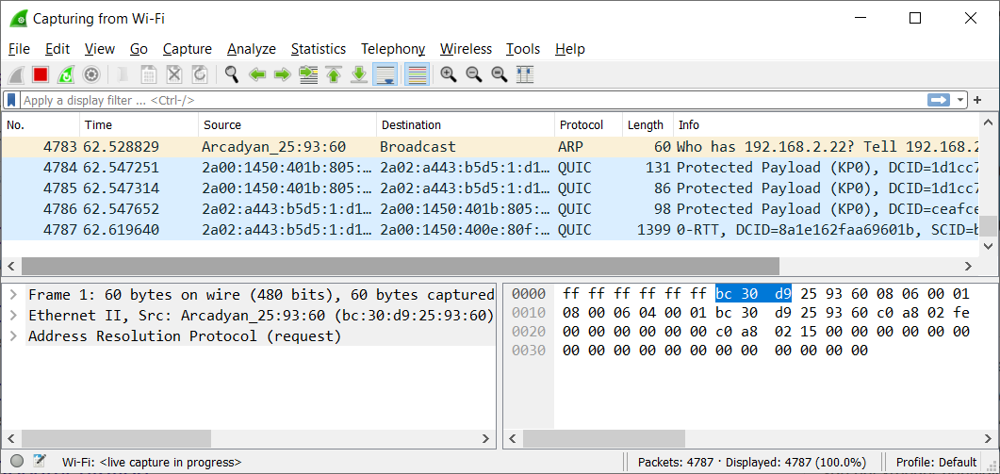

## PROTOCOLS:

A network protocol is an agreement about how to communicate. There are protocols on every layer of the OSI stack.  

The layer 4 protocols, TCP and UDP, are responsible for transporting internet packets. UDP utilises a ‘fire and forget’ strategy,  
whereas TCP utilises a ‘Three-way handshake’. TCP is therefore more reliable, but UDP is significantly faster.  

Protocols in higher layers, like HTTPS and SSH, all have their own use cases. Most of these protocols have a default port number.  

## KEY-TERMS:

* wireshark = packet sniffing tool
* TCP = transmission control protocol
* UDP = user datagram protocol  

## ASSIGNMENT:

* Identify several other protocols and their associated OSI layer. Name at least one for each layer.  
* Figure out who determines what protocols we use and what is needed to introduce your own protocol.  
* Look into wireshark and install this program. Try and capture a bit of your own network data.  
  Search for a protocol you know and try to understand how it functions.

## USED RESOURCES:

[layers-protocols](https://www.guru99.com/layers-of-osi-model.html)

[who-creates-protocols](https://snapshot.internetx.com/en/who-creates-the-standards-and-protocols-for-the-internet/)

[wireshark-in-windows](https://www.wireshark.org/download.html)

[how-to-use-wireshark](https://www.varonis.com/blog/how-to-use-wireshark)

## DIFFICULTIES:

* learning wireshark

## RESULT:

|Layer   | 	   OSI model	|    Protocols                           |TCP/IP model     |    
|:-------|:--------------:|:---------------------------------------|:---------------:|    
|Layer 7 | 	Application   | SMTP, HTTP, FTP, SSH, SNMTP            |  APPLICATION    |  
|Layer 6 | 	Presentation 	|MPEG, ASCH, SSL, TLS, SCP               |  APPLICATION    |  
|Layer 5 | 	Session 	    |NetBIOS, SAP                            |  APPLICATION    |  
|Layer 4 | 	Transport 	  |TCP, UDP                                |  TRANSPORT      |    
|Layer 3 | 	Network 	    |IPV5, IPV6, ICMP, IPSEC, ARP, MPLS      |  NETWORK        |  
|Layer 2 | 	Data Link 	  |RAPA, PPP, Frame Relay, ATM, Fiber Cable|  DATALINK       |  
|Layer 1 | 	Physical 	    |RS232, 100BaseTX, ISDN, 11              |  DATALINK       |  

### Who determines what protocols we use?

### These are the organizations that help define internet protocols and standards:

* World Wide Web Consortium **(W3C)**  
  Many of the internet standards we know, like HTML, XHTML, CSS, XML, and many more,  
  have been proposed, discussed, defined, and formalized by the W3C
* Telecommunication Standardization Sector **(ITU-T)**
* Internet Architecture Board **(IAB)**
* Institute of Electrical and Electronics Engineers **(IEEE)**
* Internet Research Task Force **(IRTF)**
* Internet Engineering Task Force **(IETF)**

### What is needed to introduce your own protocol?

* As long as you can write a specification that defines the data you send through the TCP socket, you've got your own protocol.  
  It's mostly about defining commands and payloads.  
  You've got to serialize your command packet before putting them through TCP.  
  In any case, you build your own protocol on top of an existing one.

### Wireshark:

### What is wireshark:

* Wireshark is a network protocol analyzer, an application that captures packets from a network connection,  
  such as from your computer to your home office or the internet. Packet is the name given to a discrete unit of data in  
  a typical Ethernet network. Wireshark is the most often-used packet sniffer in the world.

## Wireshark running in windows.

