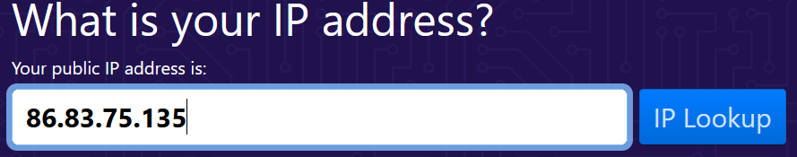

## IP-ADDRESS:

An Internet Protocol address (IP address) is a numerical label such as 192.0.2.1 that is connected  
to a computer network that uses the Internet Protocol for communication. An IP address serves two main functions:  
network interface identification and location addressing.  

## KEY-TERMS:

* WAN = wide area network (e.g. the internet)
* WLAN = wireless local area network (your wifi network)
* IPv4 = 32 bit address
* IPv6 = 128 bit address
* NAT = Network Address Translation  
        Makes sure that a router always can assign an uniq IP(v4) address to a device that wants to connect to the internet.  

## STUDY:

* IP adressing
* IPv4 en IPv6  
* Public en Private IPs  
* NAT  
* Static and dynamic adressing

## ASSIGNMENT:

* What is your public IP address of your laptop and mobile on wifi?  
* Are these addresses the same. Explain?    
* Discover what your private IP address is of your laptop and mobile on wifi.    
* Are those addresses the same? Explain.   
* Change the private IP address of your mobile into that of your laptop. What happens?  
* Try to change the private address of your mobile into an address outside of your network. What happens?  

## USED RESOURCES:

[ip-address-and-more](https://www.whatismyip.com/)

## DIFFICULTIES:

* None.

## RESULT:

### What is the public IP address of my phone and laptop on wifi.
* My public IP address is 86.83.75.133 so my phone and laptop have the same public IP.  
  Every device connected to a single network has the same public, outward-facing IP address.    
  A public IP address identifies you to the wider internet so that all the information you're searching for can find you.   
  A private IP address is used within a private network to connect securely to other devices within that same network.  
  

### Discover what my private IP addresses are of phone and laptop. 
* Private IP address of phone: 192.168.2.2 
* Private IP address of laptop: 192.168.2.3  
  These addresses are different to be able to communicate with these devices.  

### Change the private IP of my phone into my laptop's IP.
* Changing my mobile's ip into my laptop's ip should disrupt the connenction on my phone but nothing happens.  
  I think my phone just switched from 2.4 GHZ to the 5 GHZ network of my wifi. I tried to see if i could catch this  
  on wireshark but i could not.  

### Changing my private address mobile into an address outside of my network.
* I'm not sure why my phone stays connected when i do this. It should go out of service i suppose.