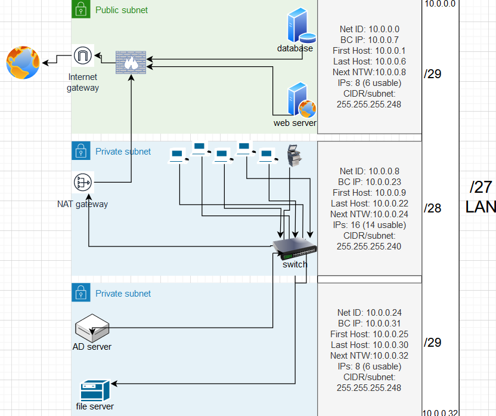

## NETWORKING CASE STUDY:

In this case study you take the role of a network administrator setting up a network in the new office of a small e-commerce company.  
Of course there are multiple ways to go about this problem, but this company has specifically said that network  
security is extremely important to them.

## KEY-TERMS:

* Active Directory (AD) = A database and set of services that connect users with the network resources they need to get their work done. 
* web server = A web server is a computer system capable of delivering web content to end users over the internet via a web browser.
* database = A database is an organized collection of structured information, or data, typically stored electronically in a computer system.
* webshop = A business that operates through a website, selling goods or services.

## ASSIGNMENT:

**An office contains the following devices:**
* A web server where our webshop is hosted
* A database with login credentials for users on the webshop
* 5 workstations for the office workers
* A printer
* An AD server
* A file server containing internal documents  

Design a network architecture for the above use case.  
Explain your design decisions  

As a network administrator you get to choose which networking devices get used.  

## USED RESOURCES:
[flowchart-maker](https://app.diagrams.net/)

### Previous assignment, subnetting.

## DIFFICULTIES:

No.

## RESULT:

### Explanation:

* A public subnet for the webshop database, web server and a firewall before the internet gateway.
* A private subnet for the 5 work stations and printer connected to a switch connected to a NAT gateway.
* A 2nd private subnet for the AD server and file server connected to private subnet switch.

For security reasons the switch is connected to a NAT gateway which is connected to the public subnet firewall.  