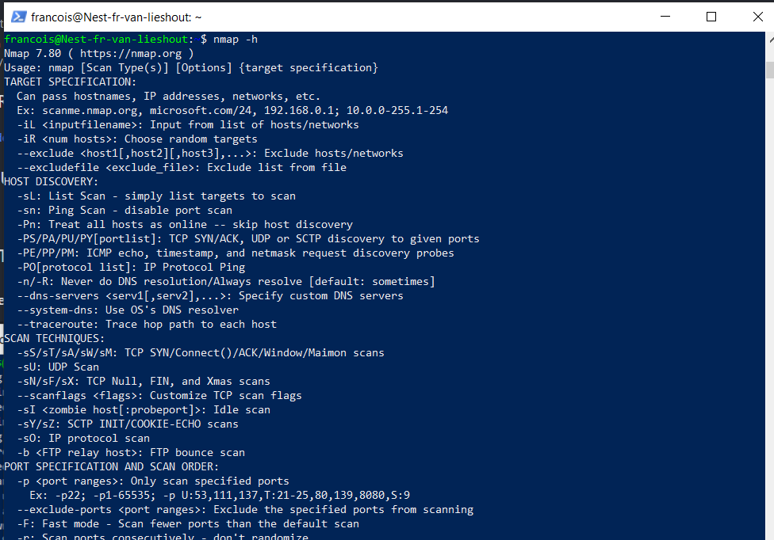
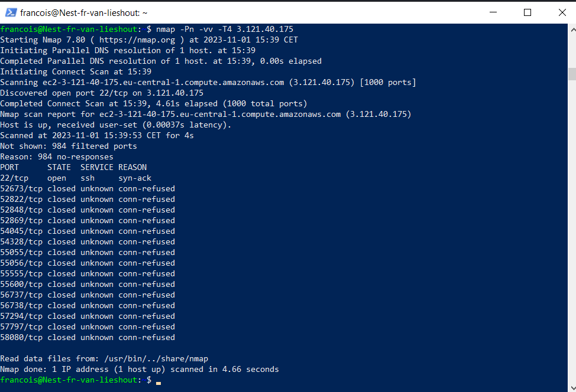
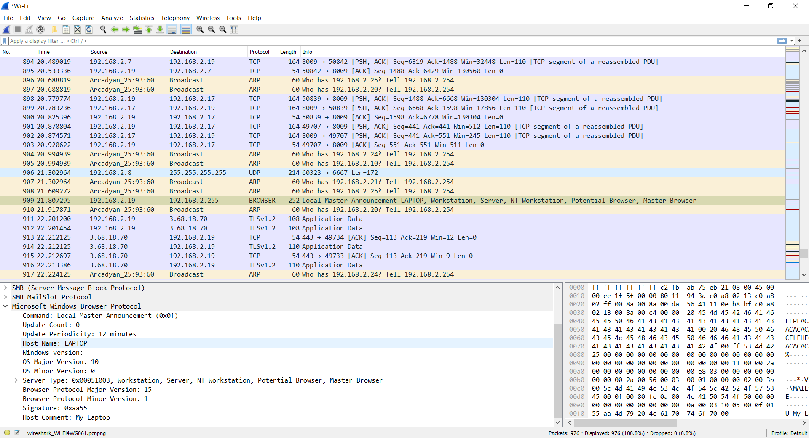

## NETWORK DETECTION:

In order to prevent or stop attacks on a network, you must be able to analyse your network.  
There are many tools available to do this, but this exercise will focus on two very popular ones: nmap and Wireshark.  

## KEY-TERMS:

* NMAP = network mapping tool
* wireshark = packet sniffing tool

## ASSIGNMENT:

* Scan the network of your Linux machine using nmap. What do you find?  
* Open Wireshark in Windows/MacOS Machine. Analyse what happens when you open an internet browser.   
  (Tip: you will find that Zoom is constantly sending packets over the network. You can either turn off Zoom for a minute, or look 
  for the packets sent by the browser between the packets sent by Zoom.)  

## USED RESOURCES:

## DIFFICULTIES:

None

## RESULT:

### Scan the network of your Linux machine using nmap. What do you find?

### Opening a browser on my laptop showed on wireshark.

