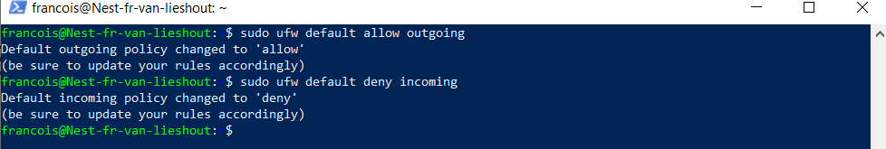

## FIREWALLS:

A Firewall is a network security device that monitors and filters incoming and outgoing network traffic based  
on an organization's previously established security policies. At its most basic, a firewall is essentially the barrier  
that sits between a private internal network and the public Internet.  

## KEY-TERMS:

* Statefull firewall = A stateful firewall is a firewall that maintains a “state” or stores information about active network connections.  
* Stateless firewall = A stateless firewall differs from a stateful one in that it doesn’t maintain an internal state from one packet to another.  
  note: A firewall examines the info from the packet header, statefull stores it, stateless don't.  
* Hardware firewall = runs on it's own physical device.
* Software firewall = runs in another machine, for instance in an OS.

## ASSIGNMENT:

* Install a webserver on your VM.
* Examine the standart page that comes with the webserver.
* Configure the firewall so that it blocks web traffic but allows ssh.
* Check if the firewall functions correctly.

## USED RESOURCES:

[google-hware-sware-firewall](https://www.google.com/search?client=firefox-b-d&q=hardware+software+firewall)

[statefull-vs-stateless](https://www.checkpoint.com/cyber-hub/network-security/what-is-firewall/what-is-a-stateful-firewall/stateful_vs_stateless_firewall/)

[firewall_config_ubuntu-20.04LTS](https://www.cyberciti.biz/faq/how-to-configure-firewall-with-ufw-on-ubuntu-20-04-lts/#Block_ports_with_ufw)

## DIFFICULTIES:

None

## RESULT:

### Apache webserver installed and running.

### Apache2 default page.

### Configuring ufw firewall.

### Checking if IPv6 is enabled.

### Allowing SSH trafic.

### Enable firewall.

### Firewall configured correctly.

### Trying to access apache server from my mobile. 
