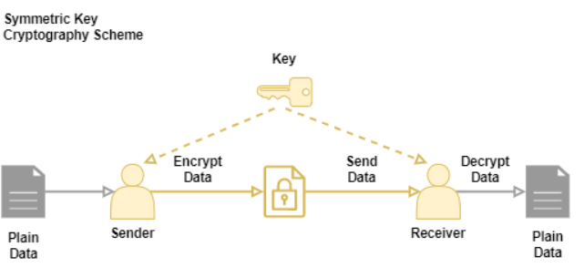
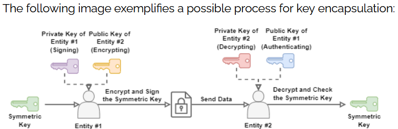
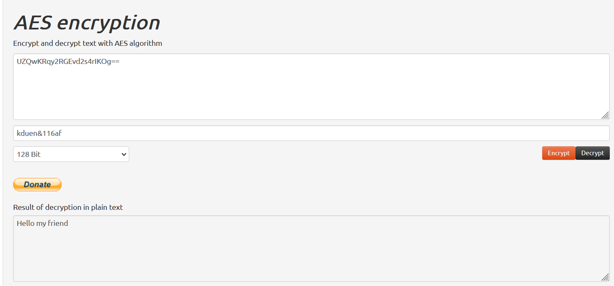
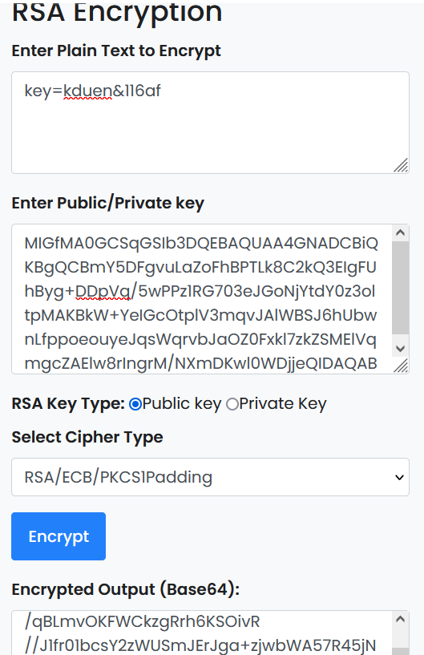
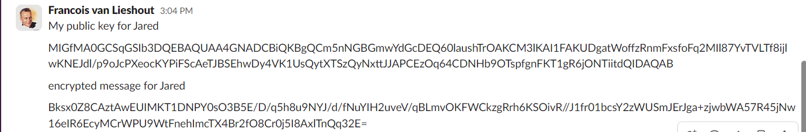
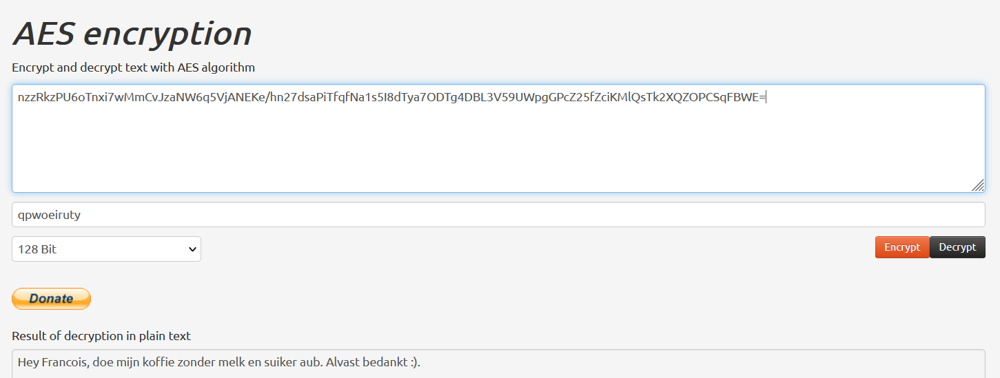

## SYMMETRIC ENCRYPTION:

**Cryptography has the main objective of securing data from being accessed by unauthorized entities.**  

Symmetric cryptography uses a unique key to both encrypt and decrypt data. In such a way, the entities  
that encrypt and decrypt data must access the same key to communicate.  

Examples of popular symmetric-key algorithms include Twofish, Serpent, AES (Rijndael algorithm) and many more.  

## KEY-TERMS:

* Encryption = A technique that transforms data into a code hard to decipher without the proper key.
* Symmetric Encryption = uses a unique key to encrypt and decrypt data

## ASSIGNMENT:

* Find one more historic cipher besides the Caesar cipher.
* Find two digital ciphers that are being used today.
* Send a symmetrically encrypted message to one of your peers via the public Slack channel. They should be able  
  to decrypt the message using a key you share with them. Try to think of a way to share this encryption key without  
  revealing it to everyone. You are not allowed to use any private messages or other communication channels besides the  
  public Slack channel. Analyse the shortcomings of symmetric encryption for sending messages.  

## USED RESOURCES:

[symmetric-cryptography](https://www.baeldung.com/cs/symmetric-cryptography)

[Diffie-Hellman-protocol](https://www.comparitech.com/blog/information-security/diffie-hellman-key-exchange/)

[historic-ciphers](https://interestingengineering.com/innovation/11-cryptographic-methods-that-marked-history-from-the-caesar-cipher-to-enigma-code-and-beyond)  

[AES-generator](https://aesencryption.net/)

## DIFFICULTIES:

Diffie-Helman protocol took some figuring out. 

## RESULT:

### Another historic cipher besides ceasar cipher:

* _Steganography_ is a method of hiding messages 'in plain sight' by camouflaging it as something else.  
  The earliest recorded use of this form of 'encryption' was described by Herodotus in his Histories.  

### Two commonly used digital ciphers today are:  

    Advanced Encryption Standard (AES): AES is a symmetric encryption algorithm that has become the de facto standard for encrypting sensitive information.  
    It is widely used in various applications, including secure communication protocols, file encryption, and data protection.  
    AES supports key sizes of 128, 192, and 256 bits and operates on fixed-size blocks of data.  

    RSA (Rivest-Shamir-Adleman): RSA is an asymmetric encryption algorithm widely used for secure communication, digital signatures,  
    and key exchange. It is based on the mathematical complexity of factoring large prime numbers. RSA utilizes a public-private key pair,  
    where the encryption key is public, and the decryption key is kept private. The security of RSA is based on the difficulty of factoring  
    large numbers into their prime factors.  

These ciphers provide secure encryption and play a crucial role in safeguarding sensitive information in various digital systems and communication channels.  

## Try to think of a way to share an encryption key.

#### In the Diffie-Hellman protocol, two entities agree on using two values: the first value (p) is a prime number consisting of the modulo of a multiplicative group of integers, and the second value (g) is a primitive root modulo of the first value. Using a big prime number secures the sharing of the key to encrypt and decrypt.   

### The best way of sending a symmetric key is, in my opinion, using a key encapsulation mechanism. 
In practice, one of the entities involved in communication creates the symmetric key and encrypts it using a public key provided by a second entity. Then, the first entity sends the encoded symmetric key to the second entity, which receives and decrypts it with the adequate private key.

In addition to simply encoding the symmetric key with a public key, the first entity can also sign the symmetric key with a private key. Thus, the first entity also provides a public key to the second one, enabling it to check the authenticity of the received symmetric key.  

## Send a symmetrically encrypted message to one of your peers.  

#### First: generate a key with AES generator. And use it to en/decrypt a message.  
  

#### Now generate public/private RSA keys and exchange public keys with your peer.  
  

#### Encrypt AES key with peers public key with the RSA encryption tool.

#### Now AES key is in possession of my peer and encrypted AES traffic can start.

#### Message from Jared decrypted with his symmetric key.

## Disadvantages of Symmetric Cryptography    
The main challenge concerning symmetric cryptography is finding a secure way to share a cryptographic key.

