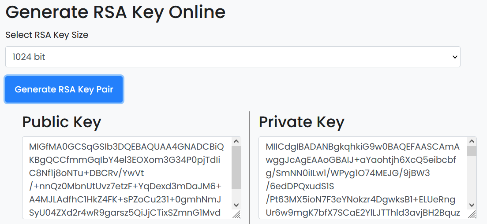
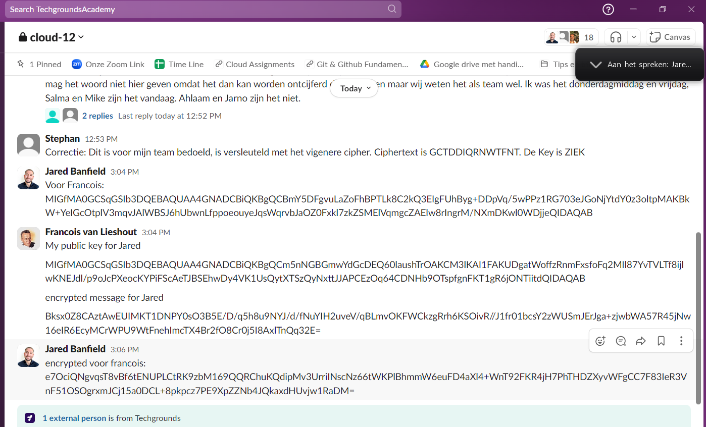
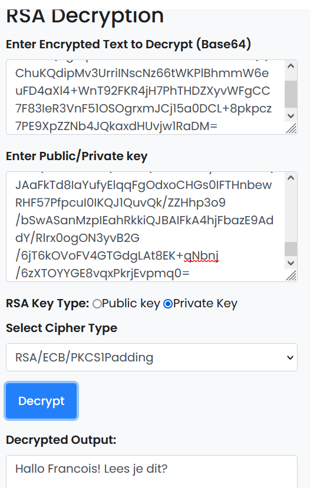

## ASYMMETRIC ENCRYPTION:
The previous assignment introduced you to cryptography and symmetric encryption. In the previous exercise, you shared  
your encryption key with the recipient of your message. This means that anyone who has the key can decrypt the message.  

Asymmetric encryption solves this issue. Instead of 1 key, you get 2: A public key, and a private key.  

## KEY-TERMS:

* Asymmetric Encryption = also known as asymmetric cryptography allows users to encrypt information using shared keys. (public and private keys)

## ASSIGNMENT:

* Generate a key pair.
* Send an asymmetrically encrypted message to one of your peers via the public Slack channel. They should be able to decrypt  
  the message using a key. The recipient should be able to read the message, but it should remain a secret to everyone else.   
  You are not allowed to use any private messages or other communication channels besides the public Slack channel.  
  Analyse the difference between this method and symmetric encryption.  

## USED RESOURCES:

[asymmetric-encryption_tool](https://www.devglan.com/online-tools/rsa-encryption-decryption)

## DIFFICULTIES:

None

## RESULT:

### Generate a public and private key-pair.

### Exchanging public keys with peer.

### Decrypting a message with pubLic key send by peer.

