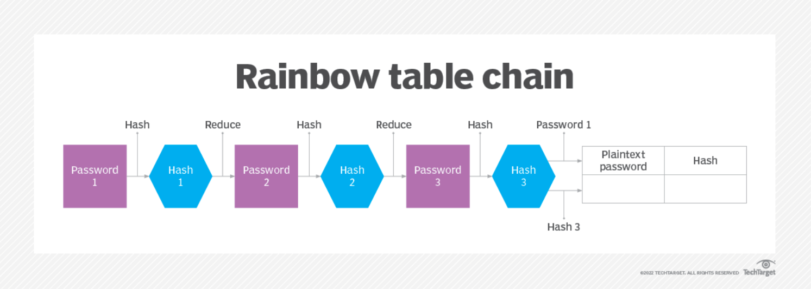
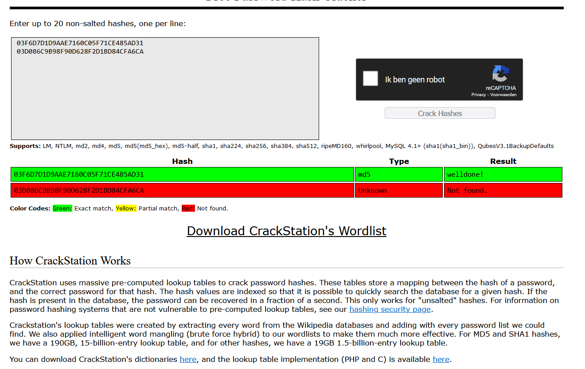
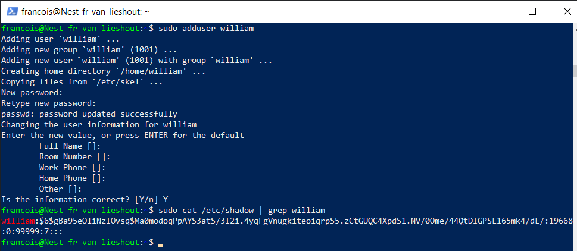
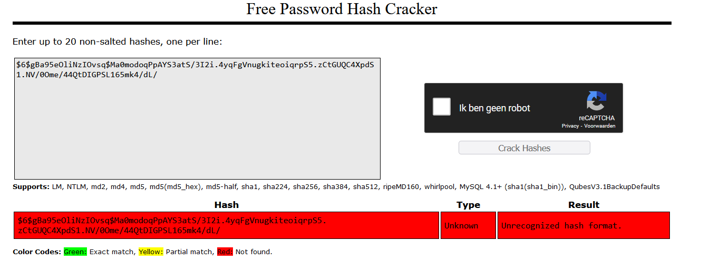

## PASSWORDS:

A Password is a word, phrase, or string of characters intended to differentiate an authorized user or process   
(for the purpose of permitting access) from an unauthorized user, or put another way, a password is used   
to prove one's identity, or authorize access to a resource.  

## KEY-TERMS:

* RAINBOW TABLE = Listing of the password hash values
* HASHING = Plaintext is scrambled into a unique digest
* SALTING = Salting works by adding an extra secret value to the input, extending the length of the original password.  

## ASSIGNMENT:

* Find out what hashing is and why it is preferred over symmetric encryption for storing passwords.  
* Find out how a Rainbow Table can be used to crack hashed passwords.  
* Below are two MD5 password hashes. One is a weak password, the other is a string of 16 randomly generated characters. Try to look up both hashes in a Rainbow Table.  
  03F6D7D1D9AAE7160C05F71CE485AD31  
  03D086C9B98F90D628F2D1BD84CFA6CA  
* Create a new user in Linux with the password 12345. Look up the hash in a Rainbow Table.  
* Despite the bad password, and the fact that Linux uses common hashing algorithms, you won’t get a match in the Rainbow Table.  
  This is because the password is salted. To understand how salting works, find a peer who has the same password in /etc/shadow, and compare hashes.  

## USED RESOURCES:

[encryption-vs-hashing](https://www.encryptionconsulting.com/education-center/encryption-vs-hashing)

[RainbowTable](https://www.techtarget.com/whatis/definition/rainbow-table)

[crackstation](https://crackstation.net/)

[shadow-file-explained](https://linuxize.com/post/etc-shadow-file/)

## DIFFICULTIES:

SHA512 hash not recognised by rainbow table. I've tried it without $ID$SALTING$ but i got not results.

## RESULT:

### Why is hashing preffered over symmetric encryption?  
The short version: Encryption is reversable and Hashing is irreversable.

Encryption is a two-way function where data is passed in as plaintext and comes out as ciphertext, which is unreadable.   
Since encryption is two-way, the data can be decrypted so it is readable again. Hashing, on the other hand, is one-way,   
meaning the plaintext is scrambled into a unique digest, through the use of a salt, that cannot be decrypted.  

Technically, hashing can be reversed, but the computational power needed to decrypt it makes decryption infeasible.  

### How can a Rainbow Table be used to crack passwords.

To crack a password, or for rainbow table attacks, large numbers of hashes are run through a dataset and then through multiple  
reduction stages to split them into smaller components that are linked to plaintext characters. The plaintext passwords are then  
stored in the table next to their hashes.  

A password-cracking program then compares the rainbow table's list of potential hashes to hashed passwords in the database.   
If there's a match, the plaintext that produced the hash is retrieved and the process is stopped. With the correct hash,   
the threat actor can now successfully access the device -- they've cracked the authentication process.

###  Look up 2 hashes in a Rainbow Table.  

### Create a new user in Linux with the password 12345. Look up the hash in a Rainbow Table.  

### Look up the hash in a Rainbow Table.

### Find a peer who has the same password in /etc/shadow, and compare hashes.

#### As you can see below, the hashes are different due to the salting of the hash.
Francois:  
$6$gBa95eOliNzIOvsq$Ma0modoqPpAYS3atS/3I2i.4yqFgVnugkiteoiqrpS5.zCtGUQC4XpdS1.NV/0Ome/44QtDIGPSL165mk4/dL/  

Jared:  
$6$em/RM4xaNeTtQYn5$mk3gEZ.pBx00CDywbmODTId010adKdUPwXi5/Xz/aQWw9Dp.WHM05k3g7rnGE6eXTLlrC3IfqCFJBI3Db3UCe0  
