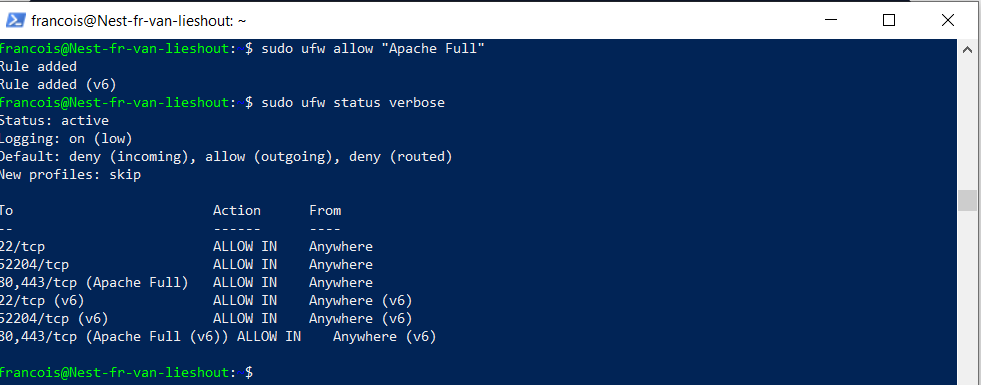
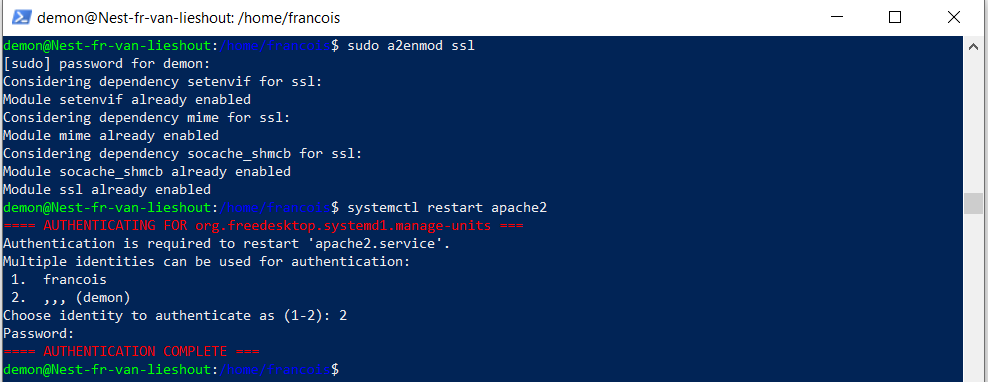
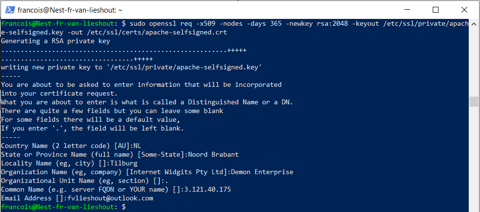
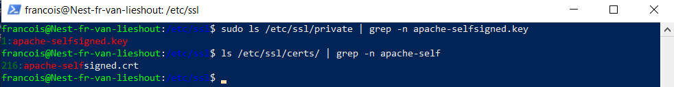
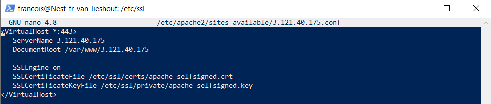
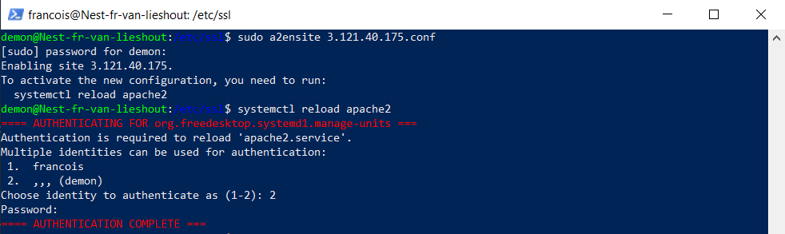

## PUBLICKEY INFRASTRUCTURE:

Public Key Infrastructure (PKI) is a set of roles, policies, hardware, software and procedures needed to  
create, manage, distribute, use, store and revoke digital certificates and manage public-key encryption.  
It consists of three entities that assure you can communicate securely over an insecure network like the public internet.  

## KEY-TERMS:

* SSL = Secure Socket Layer
* TLS = Transport Layer Security

## ASSIGNMENT:

* Create a self-signed certificate on your VM.  
* Analyze some certification paths of known websites (ex. techgrounds.nl / google.com / ing.nl).  
* Find the list of trusted certificate roots on your system (bonus points if you also find it in your VM).  

## USED RESOURCES:

[installing-ssl](https://www.atlantic.net/dedicated-server-hosting/how-to-create-and-install-a-self-signed-ssl-certificate-on-ubuntu-20-04/)

[openssl-quick-ref](https://www.digicert.com/kb/ssl-support/openssl-quick-reference-guide.htm)

[self-signed-certificate-for-apache](https://www.digitalocean.com/community/tutorials/how-to-create-a-self-signed-ssl-certificate-for-apache-in-ubuntu-20-04)
## DIFFICULTIES:

* creating the certificate, it took a while before i found the right manual for apache.

## RESULT:

### Create a self-signed certificate:  

#### Open in VM ufw firewall ports 80 and 443.  
  

## Step 1 - Enabling mod_ssl:  

#### Before we can use any SSL certificates, we first have to enable mod_ssl, an Apache module that provides support for SSL encryption.  
#### (Because i ssh into the VM i have no password and therefore created another user with sudo priviliges.)  
 
#### The mod_ssl module is now enabled and ready for use.

## Step 2 - Creating the SSL Certificate:    

#### We can create the SSL key and certificate files with the openssl command:  
  
#### Both of the files you created will be placed in the appropriate subdirectories under /etc/ssl.  

## Step 3 – Configuring Apache to Use SSL:  
#### VirtualHost config.      

#### Enable config file and do a config test.  
  

#### Trusted certificate roots list.

