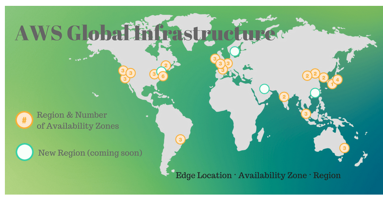
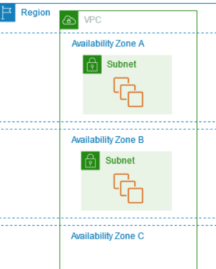

## AWS GLOBAL INFRASTRUCTURE:

In the cloud, everything from servers to networking is virtualized. As an AWS customer, you don’t have to worry   
about the underlying physical infrastructure. That being said, the physical location of an application in the cloud can be important.

AWS has a global infrastructure made up of the following components:
* Regions
* Availability Zones
* Edge Locations

## KEY-TERMS:

* Region = A separate geographic area.
* AZ = Availability Zones are multiple, isolated locations within each Region.
* Edge Location = AWS data center.  
* AMI = Amazon Machine Image (AMI) is used to create virtual servers e.g. EC2 instances
* EC2 = Elastic Compute Cloud (an AWS service)

## ASSIGNMENT:

Study:
* What is an AWS Availability Zone?
* What is a Region?
* What is an Edge Location?  

Why would you choose one region over another? (e.g. eu-central-1 (Frankfurt) over us-west-2 (Oregon)).  

## USED RESOURCES:

[regions-availabilityzone](https://docs.aws.amazon.com/AWSEC2/latest/UserGuide/using-regions-availability-zones.html)

[global-infrastructure](http://www.itcheerup.net/2018/04/aws_global_infrastructure/)

## DIFFICULTIES:

None

## RESULT:

#### What is a Region?  
AWS Regions are physical locations around the world where Amazon clusters data centers for application   
and service delivery in AWS Availability Zones.   

Each Region is designed to be isolated from other regions, this achieves the greatest possible   
fault tolerance and stability. Your account determines the Regions that are available to you.   
When you launch an instance (EC2), you must select an AMI(Amazon Machine Image) that's in the same Region.   

#### What is an AWS Availability Zone?  
Each Region has multiple, isolated locations known as Availability Zones. The code for Availability Zone is   
its Region code followed by a letter identifier. For example, us-east-1a.  

When you launch an instance, you select a Region and a virtual private cloud (VPC), and then you can select a subnet from one of the Availability Zones.     

  
**Multiple Availability Zones in an AWS Region**  

#### What is an Edge Location? 
Edge location is a Content Delivery Network (CDN) endpoint for AWS to cache contents and reduce latency.   
Edge Locations are usually deployed in major cities and highly populated areas across the globe.  

AWS Edge Locations provide an additional layer of network infrastructure that provides these benefits to any web application   
that uses Amazon CloudFront, Global Accelerator and Amazon Route 53. With these services, you can comprehensively protect   
on the edge your applications running from AWS Regions.  

#### Why would you choose one region over another?  
It is a best practice to choose a region that is geographically close to users;   
this reduces latency because data reaches the users more quickly.   

Also for regulation purposes, every country has it's own rules.

