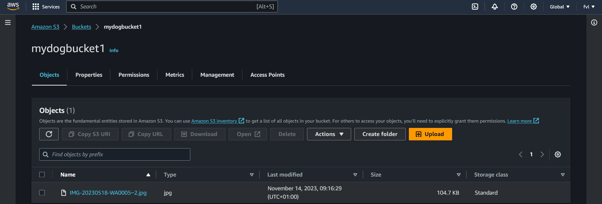
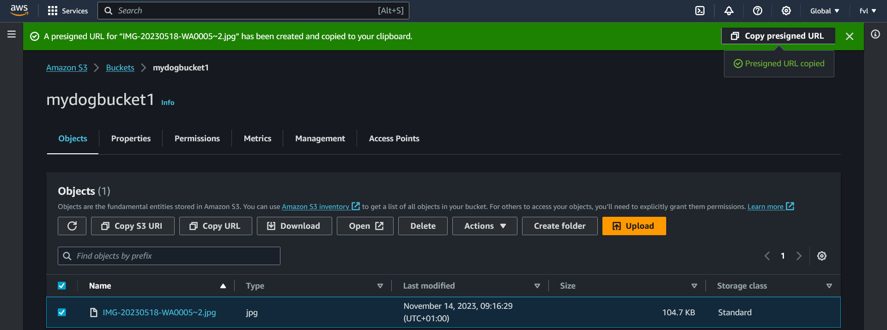
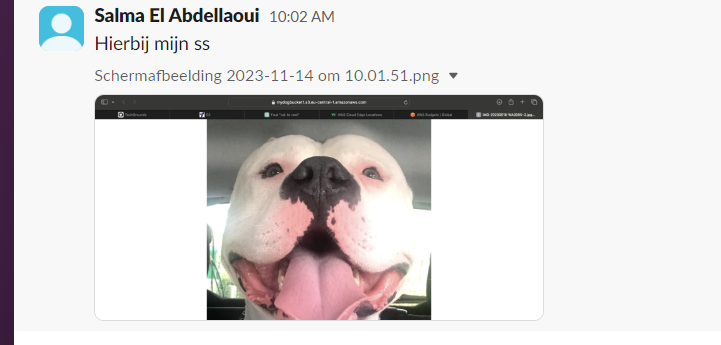
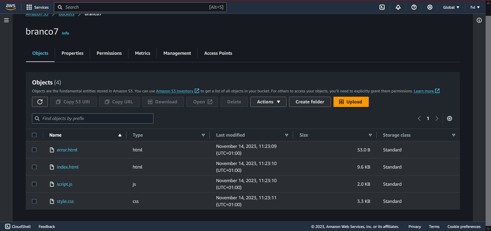
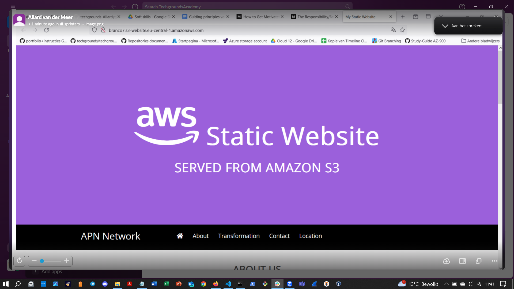

## S3: Simple Storage Service

AWS offers object based storage in the form of S3. S3 makes use of buckets as a container for objects.   
A single object in S3 has a maximum size of 5TB. However, the total size of a bucket is virtually unlimited.  

## KEY-TERMS:

* S3 = Simple Storage Service  
* Bucket = A container to store objects in.  
* Pre-signed URL = Pre-signed URLs are used to provide short-term access to a private object in your S3 bucket.
* End Point = When you configure your bucket as a static website, the website is available at the AWS Region-specific website endpoint of the bucket.  

## ASSIGNMENT:

#### Exercise 1:  
**Create a new S3 bucket with the following requirements:**  
* Region: Frankfurt (eu-central-1)  
* Upload a dog picture to your bucket.  

Share the object URL of your cat picture with a peer. Make sure they are able to see the picture.    

#### Exercise 2:  
**Create a new bucket with the following requirements:**  
* Region: Frankfurt (eu-central-1)  
* Upload the four files that make up AWS’ demo website.  
* Enable static website hosting.  

Share the bucket website endpoint with a peer. Make sure they are able to see the website.    

## USED RESOURCES:
exercise1:  
#### Create a bucket.  
[create-S3buckets-overview](https://docs.aws.amazon.com/AmazonS3/latest/userguide/create-bucket-overview.html)  

#### Upload a picture.  
[creating_pre-signed_url](https://docs.aws.amazon.com/AmazonS3/latest/userguide/ShareObjectPreSignedURL.html)   

Exercise2:  
[AWS-tutorial-static-website](https://docs.aws.amazon.com/AmazonS3/latest/userguide/HostingWebsiteOnS3Setup.html)

[website-endpoint](https://docs.aws.amazon.com/AmazonS3/latest/userguide/WebsiteEndpoints.html)  

[read-permission](https://docs.aws.amazon.com/AmazonS3/latest/userguide/WebsiteAccessPermissionsReqd.html)  

## DIFFICULTIES:
None.

## RESULT:

### Exercise 1:  
  

#### Screenshot van peer.  

### Exercise 2:  
#### New bucket with uploaded demo files.  
  

#### Screenshot from Allard.    
  

