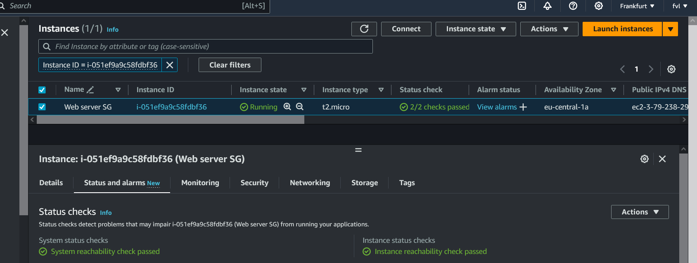
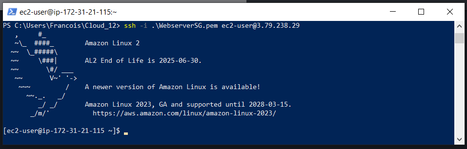
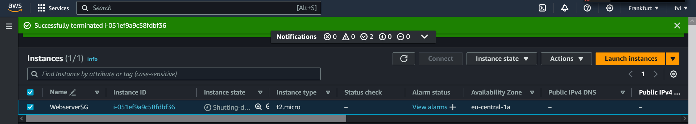

## EC2:

Amazon Elastic Compute Cloud (Amazon EC2) provides on-demand, scalable computing capacity in the Amazon Web Services (AWS) Cloud.   
Using Amazon EC2 reduces hardware costs so you can develop and deploy applications faster. You can use Amazon EC2 to launch as   
many or as few virtual servers as you need, configure security and networking, and manage storage. You can add capacity (scale up)   
to handle compute-heavy tasks, such as monthly or yearly processes, or spikes in website traffic. When usage decreases,   
you can reduce capacity (scale down) again.  

## KEY-TERMS:

* EC2 = Elastic Compute Cloud, a VM server.  
* Amazon Machine Images (AMIs) = Preconfigured templates for your instances that package the components you need for your server.  
* Instances = Virtual servers.  
* Instance types = Various configurations of CPU, memory, storage, networking capacity, and graphics hardware for your instances.  
* Key pairs = Secure login information for your instances. AWS stores the public key and you store the private key in a secure place.  
* Instance store volumes = Storage volumes for temporary data that is deleted when you stop, hibernate, or terminate your instance.  
* EBS volumes = Persistent storage volumes for your data using Amazon Elastic Block Store (Amazon EBS).  

## ASSIGNMENT:

#### Exercise 1:   
Navigate to the EC2 menu.  
Launch an EC2 instance with the following requirements:  
* AMI: Amazon Linux 2 AMI (HVM), SSD Volume Type  
* Instance type: t2.micro  
* Default network, no preference for subnet  
* Termination protection: enabled  
User data:  
    #!/bin/bash  
    yum -y install httpd  
    systemctl enable httpd  
    systemctl start httpd  
    echo '<html><h1>Hello From Your Web Server!</h1></html>' >     
    /var/www/html/index.html  
    
Root volume: general purpose SSD, Size: 8 GiB  
New Security Group:  
Name: Web server SG  
Rules: Allow SSH, HTTP and HTTPS from anywhere  

#### Exercise 2:  
Wait for the Status Checks to get out of the initialization stage. When you click the Status Checks tab,   
you should see that the System reachability and the Instance reachability checks have passed.
Log in to your EC2 instance using an ssh connection.
Terminate your instance.

## USED RESOURCES:

[EC2-concepts](https://docs.aws.amazon.com/AWSEC2/latest/UserGuide/concepts.html)

[create-key-pairs](https://docs.aws.amazon.com/AWSEC2/latest/UserGuide/create-key-pairs.html)  

[connect-via-putty](https://docs.aws.amazon.com/AWSEC2/latest/UserGuide/putty.html)  

## DIFFICULTIES:
None.

## RESULT:

#### EC2 webserverSG: 
  

#### webserverSG login:  
  

#### EC2 terminated.  

