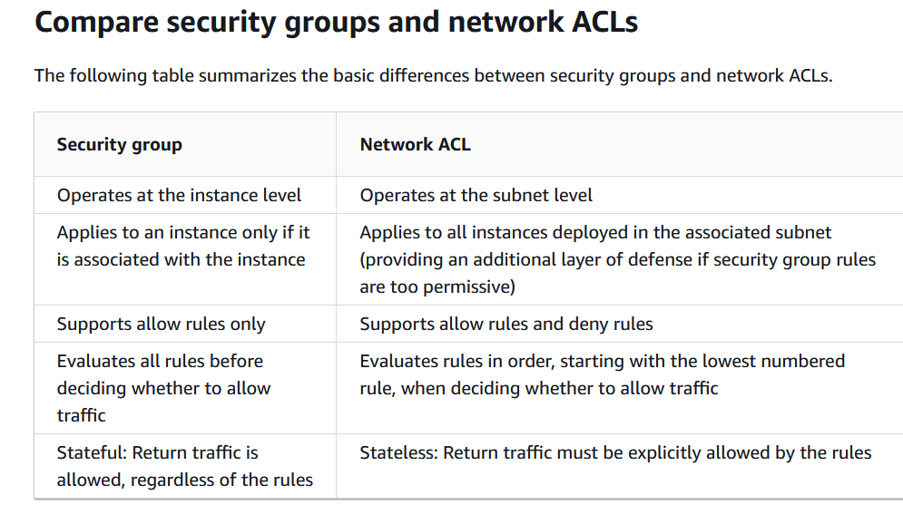
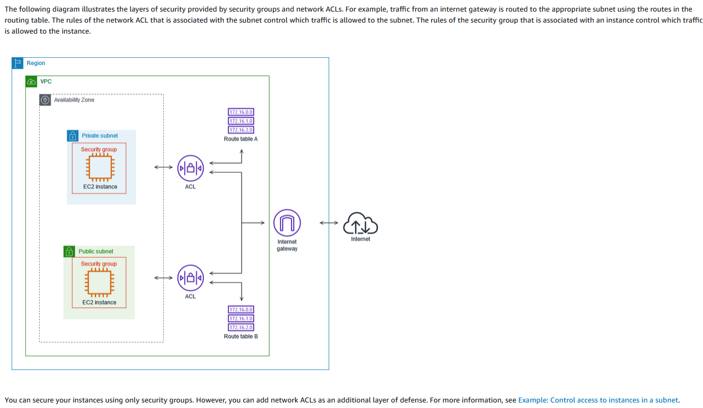

## SECURITY GROUPS:
Security Groups are stateful virtual firewalls that can be assigned to instances. They do not run in the OS, but rather in the VPC.  
Security Groups only have allow rules. Everything not explicitly allowed is automatically implicitly denied.  

A Network Access Control List (NACL) is a stateless firewall that runs on the subnet level in a VPC.  
A NACL has both explicit allow and deny rules. By default, a NACL is configured to allow all traffic in and out of the network.  

## KEY-TERMS:

* VPC = Virtual Private Cloud      
* Security Group = Act's as a stateful firewall. Response traffic is allowed, regardless of the rules.  
* Firewall Manager = Simplifies your security group administration and maintenance tasks across multiple accounts and resources. 
* Network ACL = Network Access Control List  

## ASSIGNMENT:

#### Study:  
* Security Groups in AWS  
* Network Access Control Lists in AWS  

## USED RESOURCES:

[security-groups](https://docs.aws.amazon.com/vpc/latest/userguide/vpc-security-groups.html)  
  
[infrastructure-security](https://docs.aws.amazon.com/vpc/latest/userguide/infrastructure-security.html#VPC_Security_Comparison)  

[network-ACL](https://docs.aws.amazon.com/vpc/latest/userguide/vpc-network-acls.html#nacl-basics)  

## DIFFICULTIES:

None.

## RESULT:  

**Comparing ACL's with Security Groups.**  
  

#### The following diagram illustrates the layers of security provided by security groups and network ACLs. For example,   
#### traffic from an internet gateway is routed to the appropriate subnet using the routes in the routing table. The rules   
#### of the network ACL that is associated with the subnet control which traffic is allowed to the subnet. The rules of the   
#### security group that is associated with an instance control which traffic is allowed to the instance.  

**Layers of security.**  
  
#### You can secure your instances using only security groups. However, you can add network ACLs as an additional layer of defense.  

