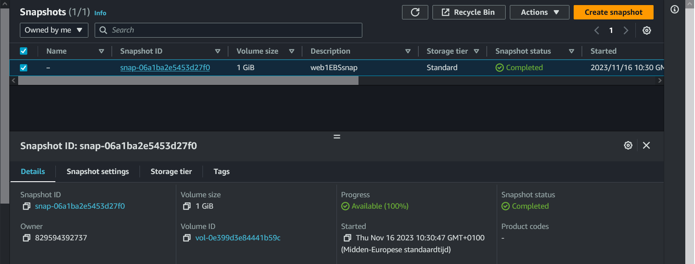

## Elastic Block Store (EBS):

EBS can be seen as virtual hard drives in the cloud. They can be either root volumes (like an internal hard disk),   
or separate volumes (like an external hard disk). One instance of an EBS is called a volume. One volume can usually   
only be attached to one EC2 instance at a time, although for every non-root volume, you can detach it and attach it   
to a different EC2 instance. EBS Multi-Attach is only available in specific cases.  

You can create snapshots of a volume to create backups or new identical volumes. These snapshots will be stored in S3.  
There are four different volume types. Generally speaking, lower performance means lower cost, but newer generations or   
specialized hardware might give better performance for lower costs.  

## KEY-TERMS:

* EBS = Elastic Block Storage  
* snapshot = A snapshot contains all of the information that is needed to restore your data (from the moment when the snapshot was taken) to a new EBS volume.  

## ASSIGNMENT:

#### Exercise 1:  
Navigate to the EC2 menu.  
Create a t2.micro Amazon Linux 2 machine with all the default settings.  
Create a new EBS volume with the following requirements:  
* Volume type: General Purpose SSD (gp3)  
* Size: 1 GiB  
Availability Zone: same as your EC2  
Wait for its state to be available.  

#### Exercise 2:  
* Attach your new EBS volume to your EC2 instance.  
* Connect to your EC2 instance using SSH.  
* Mount the EBS volume on your instance.  
* Create a text file and write it to the mounted EBS volume.

#### Exercise 3:  
* Create a snapshot of your EBS volume.  
* Remove the text file from your original EBS volume.  
* Create a new volume using your snapshot.  
* Detach your original EBS volume.  
* Attach the new volume to your EC2 and mount it.  
* Find your text file on the new EBS volume.  

## USED RESOURCES:

[creating-EBS-volume](https://docs.aws.amazon.com/AWSEC2/latest/UserGuide/ebs-creating-volume.html)  

[attach-EBS-volume](https://docs.aws.amazon.com/AWSEC2/latest/UserGuide/ebs-attaching-volume.html)  

[make-a-volume-available-for-use_format-and-mount-an-attached-volume](https://docs.aws.amazon.com/AWSEC2/latest/UserGuide/ebs-using-volumes.html)  

[detaching-EBS-volume](https://docs.aws.amazon.com/AWSEC2/latest/UserGuide/ebs-detaching-volume.html)  

[snapshots](https://docs.aws.amazon.com/AWSEC2/latest/UserGuide/EBSSnapshots.html)  

## DIFFICULTIES:
Not really, just had to practice a bit with EC2 and get familiar with volumes, snapshots and mounting in the CLI.  

## RESULT:

### Exercise1:  

#### New EC2 instance.  

#### EBS-volume    

### Exercise2:  
#### Attach EBS-volume to EC2 instance.
  

#### Mount the EBS volume on your instance. Create a text file and write it to the mounted EBS volume  

### Exercise3:  
#### Create a snapshot of EBS volume.
 

#### Create a new volume using your snapshot.  
  

#### Detach original volume and attach snapshot volume.  
#### Is the text file still there?  
      

