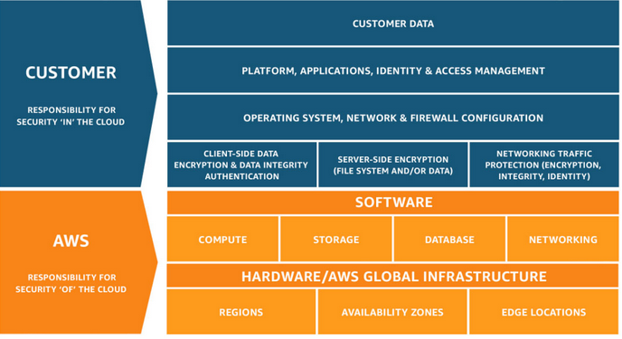

# Shared Responsability Model  
The Shared Responsibility Model describes who is responsible for the security of what part of the cloud.   
In general, you can say that AWS is responsible for security of the cloud, while the customer is responsible   
for security in the cloud. AWS is always responsible for securing the physical infrastructure,  
while the customer is always responsible for encrypting customer data.  

## Key-terms
* ***AWS responsibility “Security of the Cloud”*** = AWS is responsible for protecting the infrastructure that runs all of the services offered in the AWS Cloud.   
  This infrastructure  is composed of the hardware, software, networking, and facilities that run AWS Cloud services.  

* ***Customer responsibility “Security in the Cloud”*** = Customer responsibility will be determined by the AWS Cloud services that a customer selects.

## Opdracht
#### Study the Shared Responsibility Model.  

### Gebruikte bronnen
[Shared-Responsabilty-Model](https://aws.amazon.com/compliance/shared-responsibility-model/)    
### Ervaren problemen  
None    

### Resultaat  
  

###  Below are examples of controls that are managed by AWS, AWS Customers and/or both.  
Inherited Controls – Controls which a customer fully inherits from AWS.  

    Physical and Environmental controls  

Shared Controls – Controls which apply to both the infrastructure layer and customer layers, but in completely separate contexts or perspectives. In a shared control, AWS   provides the requirements for the infrastructure and the customer must provide their own control implementation within their use of AWS services. Examples include:  

    Patch Management – AWS is responsible for patching and fixing flaws within the infrastructure, but customers are responsible for patching their guest OS and applications.  
    Configuration Management – AWS maintains the configuration of its infrastructure devices, but a customer is responsible for configuring their own guest operating systems,   databases, and applications.  
    Awareness & Training - AWS trains AWS employees, but a customer must train their own employees.  

Customer Specific – Controls which are solely the responsibility of the customer based on the application they are deploying within AWS services. Examples include:  

    Service and Communications Protection or Zone Security which may require a customer to route or zone data within specific security environments.  

### Applying the AWS Shared Responsibility Model in Practice  
Once a customer understands the AWS Shared Responsibility Model and how it generally applies to operating in the cloud, they must determine how it applies to their use case.   Customer responsibility varies based on many factors, including the AWS services and Regions they choose, the integration of those services into their IT environment, and the   laws and regulations applicable to their organization and workload.  