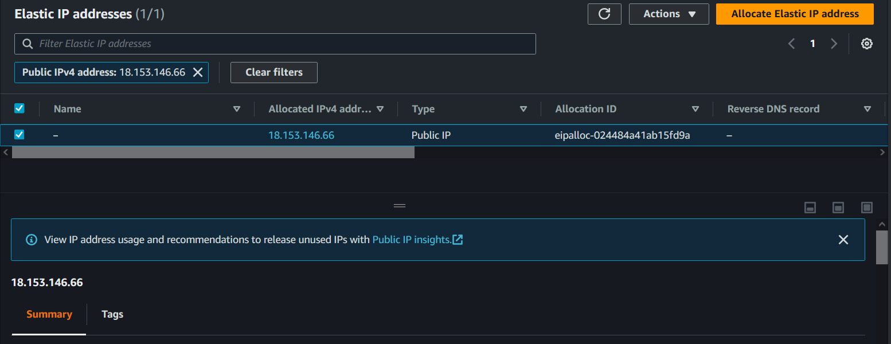
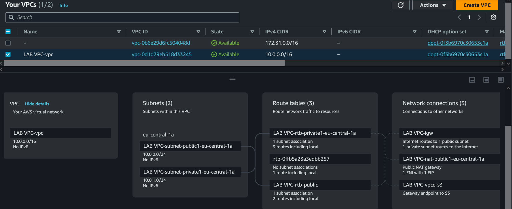
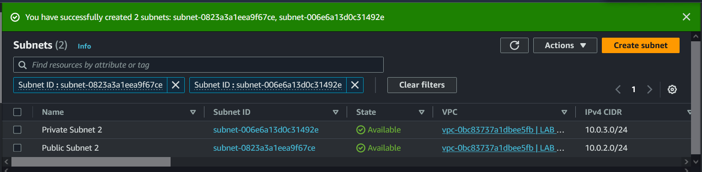
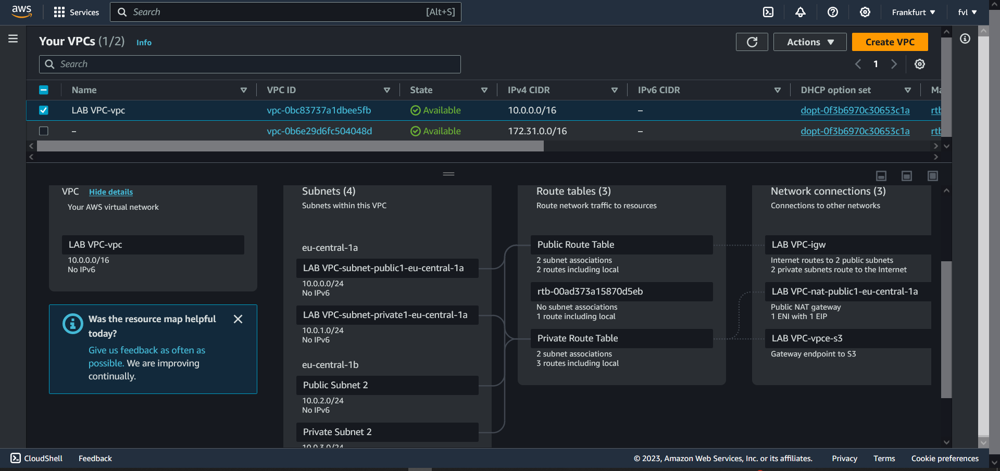
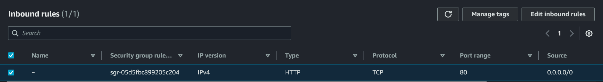
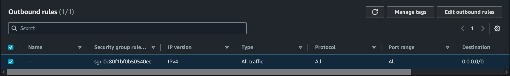
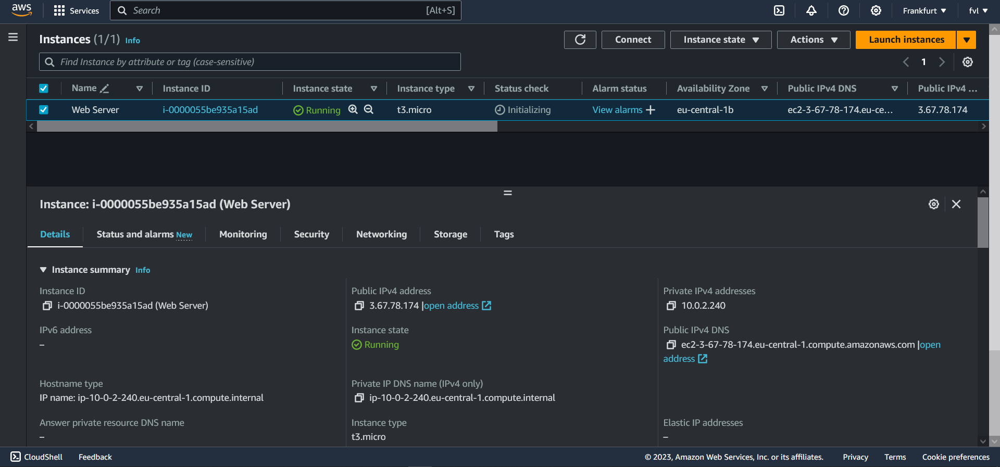
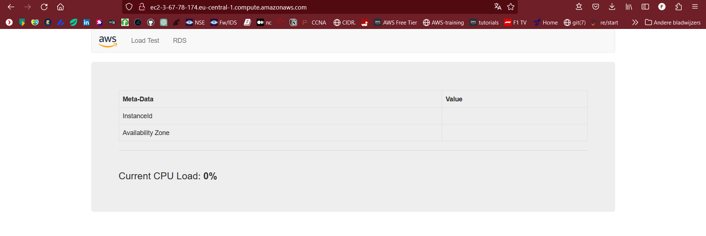
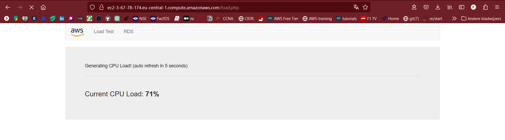

# Amazon VPC
Amazon VPC is typically described as a virtual private data center in the cloud.   
It is a virtual network that is logically isolated from other VPCs.  

With a VPC you have full control over the design of the network.  
You can create subnets, internet gateways (igw), NAT gateways, VPN connections, and more.  

Many services, like EC2, RDS and ECS require a VPC to be placed into.  

When you create a VPC, you must assign a CIDR block. Choose your CIDR block and subnet mask carefully,  
as they have to allow for enough subnets and hosts and cannot be changed after creation.  

## Key-terms  
* VPC = A VPC is a virtual network that closely resembles a traditional network that you'd operate in   
  your own data center. After you create a VPC, you can add subnets.  

* SUBNET = A subnet is a range of IP addresses in your VPC. A subnet must reside in a single Availability Zone.   
  After you add subnets, you can deploy AWS resources in your VPC.  

* IP addressing = You can assign IP addresses, both IPv4 and IPv6, to your VPCs and subnets. You can also bring your public IPv4 and   
  IPv6 GUA addresses to AWS and allocate them  to resources in your VPC, such as EC2 instances, NAT gateways, and Network Load Balancers.    

* Routing = Use route tables to determine where network traffic from your subnet or gateway is directed.   

* EIP = An Elastic IP address is a static IPv4 address designed for dynamic cloud computing. To use an Elastic IP address,   
  you first allocate one to your account, and then associate it with your instance or a network interface.   

* /16 CIDR = Class B: Allows 2^16 (65.536) host addresses on the network. The starting host address is 128.0.0.0 and the ending  
  address is 191.255.0.0. These networks use the 255.255.0.0 subnet mask, or /16 CIDR notation.  

## Opdracht
#### Exercise 1  

    Allocate an Elastic IP address to your account.  

    Create a new VPC with the following requirements:  
        Region: Frankfurt (eu-central-1)  
        VPC with a public and a private subnet  
        Name: Lab VPC  
        CIDR: 10.0.0.0/16  
    Requirements for the public subnet:  
        Name: Public subnet 1  
        CIDR: 10.0.0.0/24  
        AZ: eu-central-1a  
    Requirements for the private subnet:  
        Name: Private subnet 1  
        CIDR: 10.0.1.0/24  
        AZ: eu-central-1a  

 #### Exercise 2  

    Create an additional public subnet with the following requirements:  
        VPC: Lab VPC  
        Name: Public Subnet 2  
        AZ: eu-central-1b  
        CIDR: 10.0.2.0/24  
    Create an additional private subnet with the following requirements:  
        VPC: Lab VPC  
        Name: Private Subnet 2  
        AZ: eu-central-1b  
        CIDR: 10.0.3.0/24  
    View the main route table for Lab VPC. It should have an entry for the NAT gateway. Rename this route table to Private Route Table.  
    Explicitly associate the private route table with your two private subnets.  
    View the other route table for Lab VPC. It should have an entry for the internet gateway. Rename this route table to Public Route Table.  
    Explicitly associate the public route table to your two public subnets.  

#### Exercise 3:  

    Create a Security Group with the following requirements:  
        Name: Web SG  
        Description: Enable HTTP Access  
        VPC: Lab VPC   
        Inbound rule: allow HTTP access from anywhere  
        Outbound rule: Allow all traffic  

#### Exercise 4:  
    Launch an EC2 instance with the following requirements:  

        AMI: Amazon Linux 2  
        Type: t3.micro  
        Subnet: Public subnet 2  
        Auto-assign Public IP: Enable  
        User data:  

        #!/bin/bash  
        # Install Apache Web Server and PHP  
        yum install -y httpd mysql php unzip  
        # Download Lab files  
        wget https://aws-tc-largeobjects.s3.amazonaws.com/CUR-TF-100-RESTRT-1/80-lab-vpc-web-server/lab-app.zip  
        unzip lab-app.zip -d /var/www/html/  
        # Turn on web server  
        chkconfig httpd on   
        service httpd start  
   
        Tag:     
            Key: Name    
            Value: Web server    
        Security Group: Web SG    
        Key pair: no key pair  
    Connect to your server using the public IPv4 DNS name.  

### Gebruikte bronnen
[elastic-ip](https://docs.aws.amazon.com/AWSEC2/latest/UserGuide/elastic-ip-addresses-eip.html)   

[what-is-vpc](https://docs.aws.amazon.com/vpc/latest/userguide/what-is-amazon-vpc.html)  

[main-route-table](https://docs.aws.amazon.com/vpc/latest/userguide/VPC_Route_Tables.html#main-route-table)  

### Ervaren problemen
[Geef een korte beschrijving van de problemen waar je tegenaan bent gelopen met je gevonden oplossing.]

## Resultaat:

## Exercise 1  
### Allocate Elastic IP  

### Create VPC with public subnet and private subnet.  
  

## Exercise 2  
### Create 2 additional subnets, public and private.  
  

### Public and private route tables    
   

## Exercise 3   
### Create Security Group with Inbound and Outbound rules 
  

  

## Exercise 4  
### Launch EC2 instance  
  

### Connecting to server via public IPv4 DNS name. 
  

  

