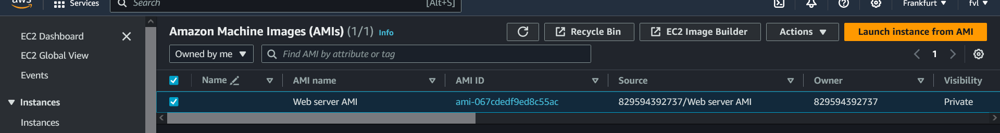
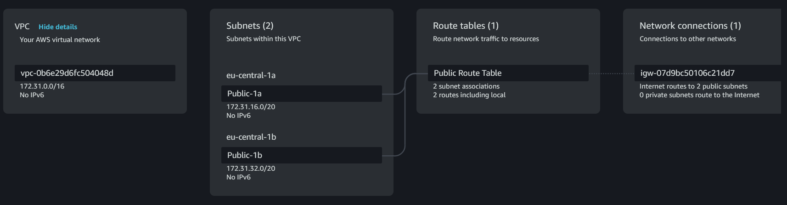
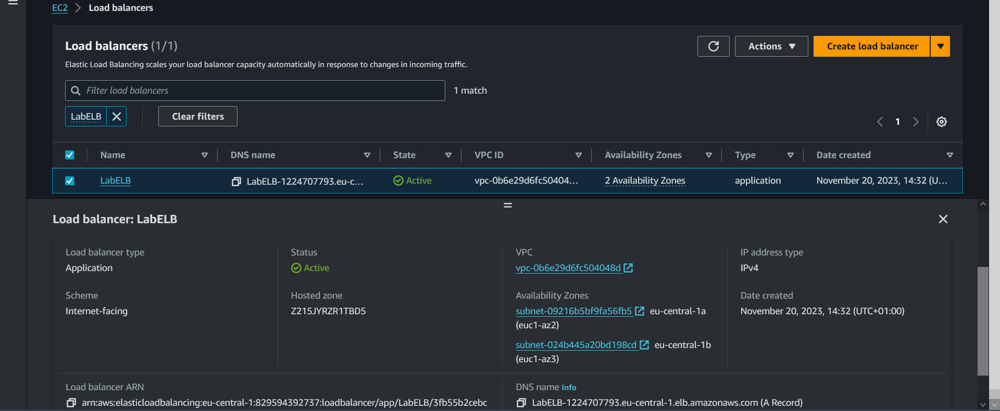
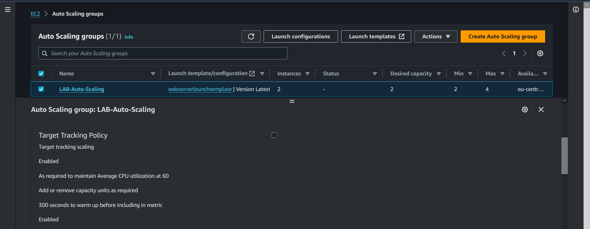

# [Onderwerp]
[Geef een korte beschrijving van het onderwerp]

## Key-terms
[Schrijf hier een lijst met belangrijke termen met eventueel een korte uitleg.]

## Opdracht  
### Exercise 1:  

    Launch an EC2 instance with the following requirements:  
        Region: Frankfurt (eu-central-1)  
        AMI: Amazon Linux 2  
        Type: t3.micro  
        User data:  

        #!/bin/bash  
        # Install Apache Web Server and PHP  
        yum install -y httpd mysql php unzip  
        # Download Lab files  
        wget https://aws-tc-largeobjects.s3.amazonaws.com/CUR-TF-100-RESTRT-1/80-lab-vpc-web-server/lab-app.zip  
        unzip lab-app.zip -d /var/www/html/  
        # Turn on web server  
        chkconfig httpd on  
        service httpd start  
        Security Group: Allow HTTP  

    Wait for the status checks to pass.  
    Create an AMI from your instance with the following requirements:  
        Image name: Web server AMI  

### Exercise 2:  
 
    Create an application load balancer with the following requirements:  
        Name: LabELB  
        Listener: HTTP on port 80  
        AZs: eu-central-1a and eu-central-1b  
        Subnets: must be public  
        Security Group:    
            Name: ELB SG    
            Rules: allow HTTP access  
        Target Group:    
            Name: LabTargetGroup    
            Targets: to be registered by Auto Scaling    

### Exercise 3:  

    Create a launch configuration for the Auto Scaling group. It has to be identical to the server that is currently running.  
    Create an auto scaling group with the following requirements:    
        Name: Lab ASG  
        Launch Configuration: Web server launch configuration  
        Subnets: must be in eu-central-1a and eu-central-1b  
        Load Balancer: LabELB  
        Group metrics collection in CloudWatch must be enabled    
            Desired Capacity: 2  
            Minimum Capacity: 2  
            Maximum Capacity: 4  
        Scaling policy: Target tracking with a target of 60% average CPU utilisation  

### Exercise 4:  

    Verify that the EC2 instances are online and that they are part of the target group for the load balancer.  
    Access the server via the ELB by using the DNS name of the ELB.  
    Perform a load test on your server(s) using the website on your server to activate auto scaling. There might be   
    a delay on the creation of new servers in your fleet, depending on the settings on your Auto Scaling Group.    

### Gebruikte bronnen
[create-AMI-from-instance](https://docs.aws.amazon.com/toolkit-for-visual-studio/latest/user-guide/tkv-create-ami-from-instance.html)  

[subnets-for-load-balancer](https://docs.aws.amazon.com/elasticloadbalancing/latest/application/application-load-balancers.html#subnets-load-balancer)  
[create-load-balancer](https://docs.aws.amazon.com/elasticloadbalancing/latest/application/create-application-load-balancer.html)  
[create-launch-template](https://docs.aws.amazon.com/AWSEC2/latest/UserGuide/create-launch-template.html#lt-defined-parameters-console)  

### Ervaren problemen  
[Geef een korte beschrijving van de problemen waar je tegenaan bent gelopen met je gevonden oplossing.]

### Resultaat

## Exercise 1  
#### Created an AMI from my EC2 instance.  

## Exercise 2  
### Creating a Application Load Balancer.  
#### Before you begin, ensure that you have a virtual private cloud (VPC) with at least one public subnet in each of the zones used by your targets.  
  

#### Created App Load Balancer  
  

## Exercise 3  
### Create Auto Scaling Group with launch config  
  

## Exercise 4  
### 

