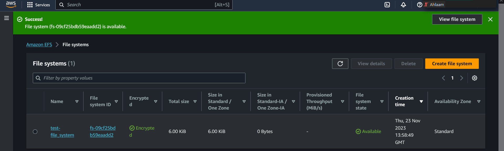
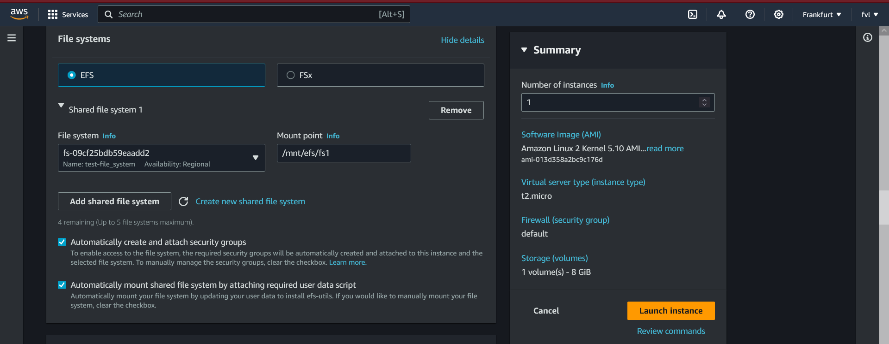
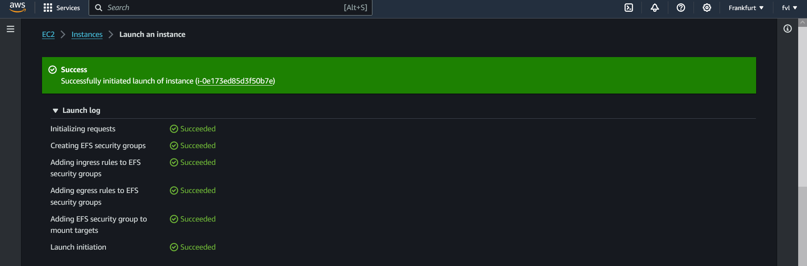

# EFS, EB, CF, R53 and RDS.  
As of this moment you will get less concrete assignments. We'll appeal more to your independent learning skills.    
Some services need to be enabled and configured once, others you only need to know theoretically.   

## Key-terms:   
* EFS = Amazon Elastic File System (Amazon EFS) provides a simple, scalable, fully managed elastic   
  NFS file system for use with AWS Cloud services, e.g EC2, and on-premises resources. 
* RDS/AURORA = Amazon Aurora is a fully managed relational database engine that's compatible with MySQL and PostgreSQL.  
* 

## Assignment:   
    Gain practical experience with:  
        EFS  
        RDS/Aurora  
        Elastic Beanstalk  
    Gain theoratical experience with:  
        CloudFront  
        Route53  

### Used sources:   
[create-EFS](https://docs.aws.amazon.com/efs/latest/ug/getting-started.html)    

[what-is-RDS](https://docs.aws.amazon.com/AmazonRDS/latest/AuroraUserGuide/CHAP_AuroraOverview.html)    

### Encountered problems:   
[Geef een korte beschrijving van de problemen waar je tegenaan bent gelopen met je gevonden oplossing.]

### Result:  
## EFS  
There are four steps that you need to perform to create and use your first Amazon EFS file system:  

* Create your Amazon EFS file system.  
* Create your Amazon EC2 resources, launch your instance, and mount the file system.  
* Transfer files to your EFS file system using AWS DataSync.  
* Clean up your resources and protect your AWS account.  

#### Create file system.  
  

#### Create EC2, launch and mount the EFS.  
#### The path shown next to the file system ID is the mount point that the EC2 instance will use   
  

#### EC2 configured with EFS and initialized.   
    

### RDS/Aurora  

