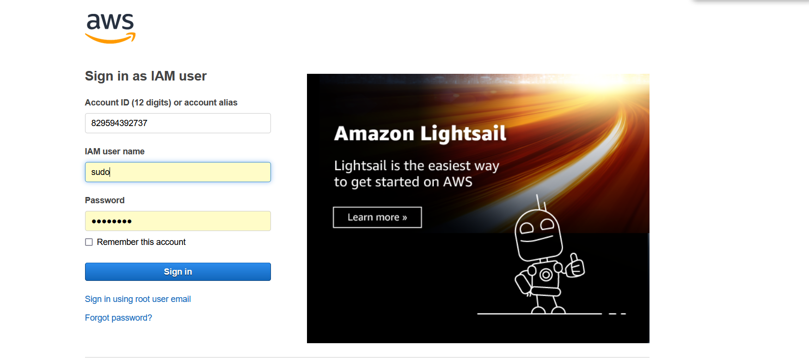
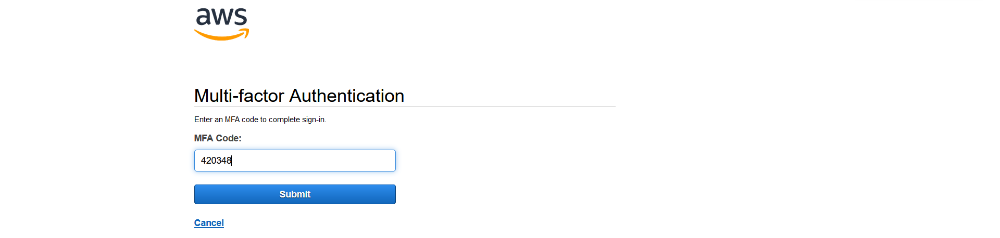
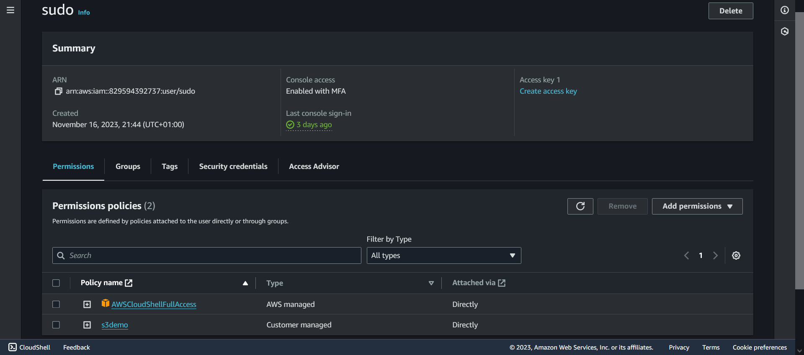

# IAM (practical assigment)
AWS Identity and Access Management (IAM) is a web service that helps you securely control access to AWS resources.  
With IAM, you can centrally manage permissions that control which AWS resources users can access. You use IAM to   
control who is authenticated (signed in) and authorized (has permissions) to use resources.  

When you create an AWS account, you begin with one sign-in identity that has complete access to all AWS services   
and resources in the account. This identity is called the AWS account root user and is accessed by signing in with   
the email address and password that you used to create the account. We strongly recommend that you don't use the   
root user for your everyday tasks. Safeguard your root user credentials and use them to perform the tasks that only  
the root user can perform.  

## Key-terms  
* IAM = Identity and Access Management  
* policy = A policy is a document that defines permissions for an AWS principal. Policies determine whether a request is allowed or denied. There are 2 kinds of policies.
* Managed policies = These are standalone policies that can be attached to users, groups and roles. When a managed policy is attached, the principal receives the permissions defined in the policy.  
* Inline policies = These are policies that are embedded directly into a single user, group or role. Inline policies apply only to the single user/group/role they are embedded in.  

## Assignment  
## IAM in practice.  

### Used sources  
[AWS-IAM](https://docs.aws.amazon.com/IAM/latest/UserGuide/introduction.html)  
[creating-IAM-user](https://docs.aws.amazon.com/IAM/latest/UserGuide/id_users_create.html)  

[intro-to-IAM](https://explore.skillbuilder.aws/learn/course/120/play/459/introduction-to-aws-identity-and-access-management-iam)  

### Encountered problems  
-

### Result  
#### IAM gives you the following features:  
*Shared access to your AWS account*   
You can grant other people permission to administer and use resources   
in your AWS account without having to share your password or access key.  

*Granular permissions*  
You can grant different permissions to different people for different resources.  
E.g. some users may have complete access to services and others read-only permission  
to these services.

*Secure access to AWS resources for applications that run on Amazon EC2*  
You can use IAM features to securely provide credentials for applications that run on EC2 instances.   
These credentials provide permissions for your application to access other AWS resources.   
Examples include S3 buckets and DynamoDB tables.  

*Multi-factor authentication (MFA)*  
You can add two-factor authentication to your account and to individual users for extra security.  

#### and more...

### IAM user 'SUDO' login.  
  

#### With MFA AuthN feature enabled.  
  

#### User has CloudShellFullAccess policy for working in the CLI. 
    

