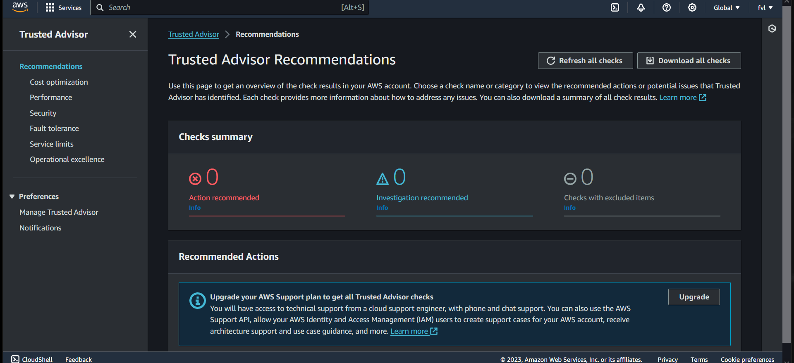

# AWS Trusted Advisor (theoretical assignment)  
#### What is a trusted advisor?  
A trusted advisor is an individual or a company that works collaboratively with their clients as a strategic partner.   
Harnessing extensive knowledge and experience, trusted advisors provide advice and guidance tailored to a firm's needs and objectives over time.    

#### AWS Trusted Advisor
Trusted advisor is an automated and managed service of aws which optimize whole infrastrutar like cost optimzation,    
security, open ports in security groups, performance, limits.  

Trusted Advisor inspects your AWS environment, and then makes recommendations when opportunities exist to save money,   
improve system availability and performance, or help close security gaps.   

You can use the Trusted Advisor Recommendations page of the Trusted Advisor console to review check results for your AWS   
account and then follow the recommended steps to fix any issues. For example, Trusted Advisor might recommend that you delete   
unused resources to reduce your monthly bill, such as an Amazon Elastic Compute Cloud (Amazon EC2) instance.  

## Key-terms  
* AWS Trusted Advisor = Automated service that draws upon best practices learned from serving hundreds of thousands of AWS customers.

## Assignment  
#### Gain theoratical knowledge of: Trusted Advisor    

### Used sources  
[AWS-docs-trusted-adviser](https://docs.aws.amazon.com/awssupport/latest/user/trusted-advisor.html) 

[AWS-docs-getting-started-with](https://docs.aws.amazon.com/awssupport/latest/user/get-started-with-aws-trusted-advisor.html#view-check-categories)  

[google-search](https://www.google.com/search?client=firefox-b-d&q=is+trusted+advisor+a+software+program)  

[AWS-console](https://us-east-1.console.aws.amazon.com/trustedadvisor/home?region=eu-central-1#/dashboard)    

[use-case-with-other-services](https://docs.aws.amazon.com/awssupport/latest/user/use-other-aws-services-with-trusted-advisor-reports.html)  

[difference-with-other-services](https://www.google.com/search?client=firefox-b-d&q=with+what+other+aws+services+can+you+compare+trusted+advisor)  

### Encountered problems  
-  

### Result  
  

#### What problem does Trusted Advisor solve?   
It helps customers with making recommendations regarding to performance, security, fault tolerance, service limits and operational   
excellence. This can be done by enabling features for every named subject. (check)  

#### Which key terms belong to Trusted Advisor?   
AWS Trusted Advisor Checks:  
* Cost Optimization.  
* Performance.  
* Security.  
* Fault Tolerance.  
* Service Limits.  

#### How does Trusted Advisor fits or replace in an on-premises setting?  
Trusted Advisor can give recommendations about Amazon ECS anywhere service that operates on-premises or a customer-managed environment.  

#### How can i combinate Trusted Advisor with other services?    
You create an Amazon Simple Storage Service (Amazon S3) bucket to store your Trusted Advisor report and an   
AWS CloudFormation template to create resources in your account. Then, you can use Amazon Athena to analyze   
or run queries for your report or Amazon QuickSight to visualize that data in a dashboard.  

#### What is the difference between Trusted Advisor and other similar services?   
What is the difference between AWS Trusted Advisor and Amazon Inspector?

* AWS Trusted Advisor is an agent-less administration tool that recommends the best practices for effective     
resource utilization in the AWS environment.   

* On the contrary, AWS Inspector is an agent-based administration tool   
that automatically evaluates user workloads for identifying vulnerabilities.    

What is the difference between AWS Trusted Advisor and AWS systems manager?

The performance, security, and reliability checks from AWS Trusted Advisor will all be combined by *Systems Manager Explorer* service.   
AWS Trusted Advisor Explorer will aggregate only cost optimization suggestions after the examination.  

