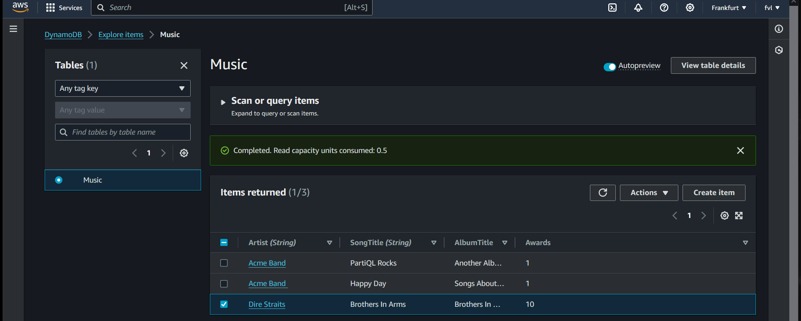

# DynamoDB (practical assignment)  
Amazon DynamoDB is a fully managed, serverless, key-value NoSQL database designed to run high-performance applications at any scale.   
DynamoDB offers built-in security, continuous backups, automated multi-Region replication, in-memory caching, and data import and export tools.  

DynamoDB lets you offload the administrative burdens of operating and scaling a distributed database so that you don't have to worry about   
hardware provisioning, setup and configuration, replication, software patching, or cluster scaling. DynamoDB also offers encryption at rest,   
which eliminates the operational burden and complexity involved in protecting sensitive data  

## Key-terms  
* Database tables = for storage and retrieval of any amount of data and serve any level of request traffic. You can scale up or    
scale down your tables' throughput capacity without downtime or performance degradation.   
* Management Console = To monitor the resource utilization and performance metrics.  
* PITR = Point-in-time-recovery allows DynamoDB to back up your table data automatically up to the last 35 days.  
* Table => contains items  
* Items => contains attributes  
* Attributes => can contain more attributes (nested, up to 32 layer deep)
* Pricing = DynamoDB charges for reading, writing, and storing data in your DynamoDB tables, along with any optional features you choose to turn on.   
DynamoDB has on-demand capacity mode and provisioned capacity mode, and these modes have pricing for processing reads and writes on your tables.  
* On-demand backup capability = Allows you to create full backups of your tables for long-term retention and archival for regulatory compliance needs.  

## Assignment  
#### Gain practical experience with: DynamoDB  

### Used sources  
[google-search](https://www.google.com/search?client=firefox-b-d&q=what+is+aws+dynamodb)  

[AWS-docs](https://docs.aws.amazon.com/amazondynamodb/latest/developerguide/Introduction.html)  

[creating-tables](https://docs.aws.amazon.com/amazondynamodb/latest/developerguide/SampleData.html)  

### Encountered problems  
-  

### Result  
#### Step 1: Create a table  
  

  

#### Once the table is in ACTIVE status, it's considered best practice to enable Point-in-time recovery for DynamoDB on the table.  
  

#### Step 2: Write data to a table using the console   
  

#### Step 3: Read data from a table  
  

#### Step 4: Update data in a table  
##### You can use the DynamoDB console to update data in the Music table.  
  

### How can i connect this service with other services.  

#### Integrating with Amazon S3  
Amazon DynamoDB import and export capabilities provide a simple and efficient way to move data between Amazon S3 and DynamoDB tables without writing any code.  

DynamoDB import and export features help you move, transform, and copy DynamoDB table accounts, or AWS. You can import from your S3 sources,   
and you can export your DynamoDB table data to Amazon S3 and use AWS services such as Athena, Amazon SageMaker, and AWS Lake Formation to analyze   
your data and extract actionable insights. You can also import data directly into new DynamoDB tables to build new applications with single-digit   
millisecond performance at scale, facilitate data sharing between tables and accounts, and simplify your disaster recovery and business continuity plans.  
