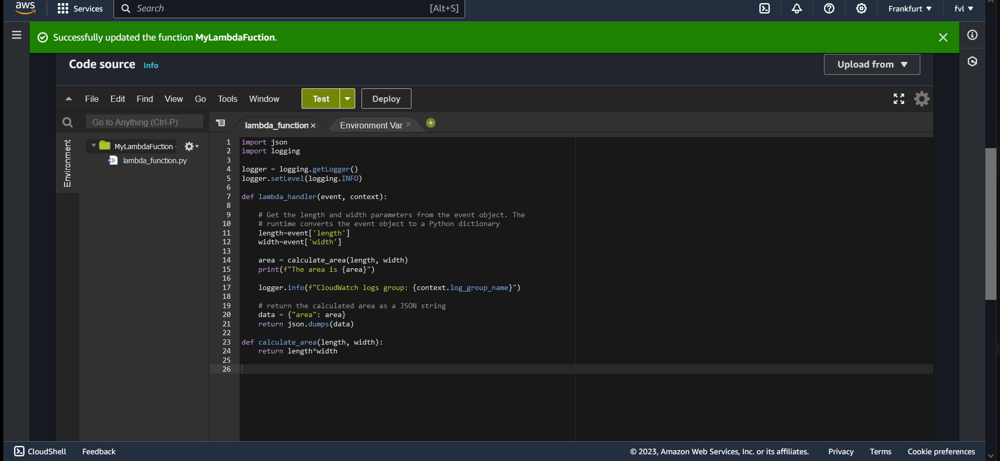

# AWS Lambda (practical assignment)  
What is AWS Lambda?  

AWS Lambda is a compute service that lets you run code without provisioning or managing servers. Hence the name 'serverless'.  

Lambda runs your code on a high-availability compute infrastructure and performs all of the administration of the compute resources,   
including server and operating system maintenance, capacity provisioning and automatic scaling, and logging. With Lambda, all you need   
to do is supply your code in one of the language runtimes that Lambda supports.  

You organize your code into Lambda functions. The Lambda service runs your function only when needed and scales automatically.   
You only pay for the compute time that you consume, there is no charge when your code is not running.  

## Key-terms  
* Serverless = Serverless is a cloud-native development model that allows developers to build and run applications without having to   
manage servers. There are still servers in serverless, but they are abstracted away from app development.  
* CloudWatch Logs = Your Lambda function comes with a CloudWatch Logs log group and a log stream for each instance of your function.   
The Lambda runtime environment sends details about each invocation and other output from your function's code to the log stream.  
* What are the 3 components of AWS Lambda?  
    - A function. This is the actual code that performs the task.  
    - A configuration. This specifies how your function is executed.  
    - An event source (optional). This is the event that triggers the function. You can trigger with several AWS services or a third-party service.  
    
## Assignment  
#### Gain practical experience with AWS Lambda.  

### Used sources  
[what-is-lambda](https://docs.aws.amazon.com/lambda/latest/dg/welcome.html)  

[getting-started](https://docs.aws.amazon.com/lambda/latest/dg/getting-started.html)  

### Encountered problems  
-  

### Result  
### When to use AWS Lambda?  
Lambda is an ideal compute service for application scenarios that need to scale up rapidly, and scale down to zero when not in demand.    
For example, you can use Lambda for:

* _File processing_: Use Amazon Simple Storage Service (Amazon S3) to trigger Lambda data processing in real time after an upload.  
* _Stream processing_: Use Lambda and Amazon Kinesis to process real-time streaming data for application activity tracking, transaction order processing,   
clickstream analysis, data cleansing, log filtering, indexing, social media analysis, Internet of Things (IoT) device data telemetry, and metering.  
* _Web applications_: Combine Lambda with other AWS services to build powerful web applications that automatically scale up and down and run in a   
highly available configuration across multiple data centers.  
* _IoT backends_: Build serverless backends using Lambda to handle web, mobile, IoT, and third-party API requests.  
* _Mobile backends_: Build backends using Lambda and Amazon API Gateway to authenticate and process API requests. Use AWS Amplify to easily    
integrate with your iOS, Android, Web, and React Native frontends.  

### Create a Lambda function with the console  
  
  

### Updating the source code.  
  

### Running the code with 'MyTestEvent'.
  

  

### To view the function's invocation records in CloudWatch Logs  
  

