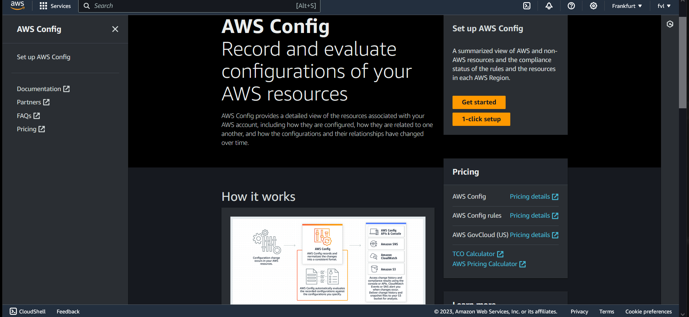

# AWS Config (theoretical assignment)  
AWS Config provides a detailed view of the configuration of AWS resources in your AWS account. This includes how the resources   
are related to one another and how they were configured in the past so that you can see how the configurations and relationships change over time.  

An AWS resource is an entity you can work with in AWS, such as an Amazon Elastic Compute Cloud (EC2) instance, an Amazon Elastic   
Block Store (EBS) volume, a security group, or an Amazon Virtual Private Cloud (VPC).   

## Key-terms  
Key components of AWS Config:
* Metadata = Information about the configuration item  
* Attributes = Resource attributes  
* Relationships = How the resource is related to other resources associated with the account  
Current configuration = Information returned through a call to the Describe or List API of the resource  

## Assignment  
### Gain theoratical knowledge of: AWS Config   

### Used sources  
[google-search](https://www.google.com/search?client=firefox-b-d&q=what+is+AWS+config)  

[AWS-docs](https://docs.aws.amazon.com/config/latest/developerguide/WhatIsConfig.html)  

[config-concepts](https://docs.aws.amazon.com/config/latest/developerguide/config-concepts.html)  

[integrate-services](https://docs.aws.amazon.com/organizations/latest/userguide/services-that-can-integrate-config.html)  

### Encountered problems  
-  

### Result   
#### What problem does Config solve?     
AWS Config provides a detailed view of the resources associated with your AWS account, including how they are configured,   
how they are related to one another, and how the configurations and their relationships have changed over time.   

#### Which key terms belong to Config?    
Understanding the basic components of AWS Config will help you track resource inventory and changes and evaluate configurations of your AWS resources.    
* _AWS Resources_: AWS resources are entities that you create and manage using the AWS Management Console, the AWS CLI, the AWS SDKs, or AWS partner tools.   
Examples of AWS resources include Amazon EC2 instances, security groups, Amazon VPCs, and Amazon Elastic Block Store. AWS Config refers to each   
resource using its unique identifier, such as the resource ID or an Amazon Resource Name (ARN).   

* _Configuration Items_: A configuration item represents a point-in-time view of the various attributes of a supported AWS resource that exists in your account.    
The components of a configuration item include metadata, attributes, relationships, current configuration, and related events. AWS Config creates a configuration   
item whenever it detects a change to a resource type that it is recording.  

* _Configuration Recorder_: The configuration recorder stores the configurations of the supported resources in your account as configuration items.   
By default, the configuration recorder records all supported resources in the region where AWS Config is running. If you use the AWS Management Console   
or the CLI to turn on the service, AWS Config automatically creates and starts a configuration recorder for you.  

* _Configuration History_: A configuration history is a collection of the configuration items for a given resource over any time period.   
A configuration history can help you answer questions about, for example, when the resource was first created, how the resource has been configured   
over the last month, and what configuration changes were introduced yesterday at 9 AM.  

* _Configuration Snapshot_: A configuration snapshot is a collection of the configuration items for the supported resources that exist in your account.   
This configuration snapshot is a complete picture of the resources that are being recorded and their configurations.  

* _Configuration Stream_: A configuration stream is an automatically updated list of all configuration items for the resources that AWS Config is recording.   
The configuration stream works by using an Amazon Simple Notification Service (Amazon SNS) topic of your choice.  

* _Resource Relationship_: AWS Config discovers AWS resources in your account and then creates a map of relationships between AWS resources.   
For example, a relationship might include an Amazon EBS volume vol-123ab45d attached to an Amazon EC2 instance i-a1b2c3d4 that is associated   
with security group sg-ef678hk.   

#### How does Config fits or replace in an on-premises setting?  
AWS Config helps you record configurations for third-party resources or custom resource types such as on-premises servers,   
software as a service (SaaS) monitoring tools, and version control systems.  

#### How can i combinate Config with other services?    
AWS Config and AWS Organizations:  

Service-linked roles created when you enable integration

The following service-linked role is created in your organization's accounts when you enable trusted access. This role allows   
AWS Config to perform supported operations within the accounts in your organization.  

* AWSServiceRoleForConfig  

This role is created when you enable AWS Config in your organization by creating a multi-account aggregator. AWS Config asks you   
to select or create a role and for you to provide the name. There is no automatically generated name.  

#### What is the difference between Config and other similar services?       
What is the difference between AWS config and CloudTrail?  

A good way to think of it is that AWS Config will tell you what your resource state is now or what it was at a specific point   
in the past whereas CloudTrail will tell you when specific events in the form of API calls have taken place.  

