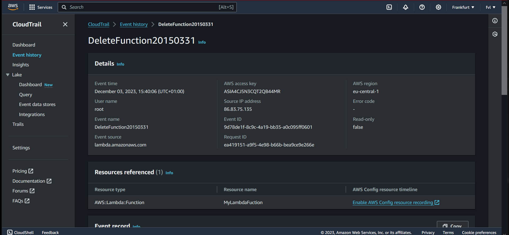

# AWS CloudTrail (theoretical assignment)
AWS CloudTrail is an AWS service that helps you enable operational and risk auditing, governance, and compliance of your AWS account.   
Actions taken by a user, role, or an AWS service are recorded as events in CloudTrail. Events include actions taken in the AWS Management Console,   
AWS Command Line Interface, and AWS SDKs and APIs.  

CloudTrail is active in your AWS account when you create it and doesn't require any manual setup. When activity occurs in your AWS account,   
that activity is recorded in a CloudTrail event.  

## Key-terms  
* Events = actions taken by a user, role or service are recorded as events  
* CloudTrail provides three ways to record events:  
    - Event history => Provides a viewable, searchable, downloadable, and immutable record of the past 90 days of management events in an AWS Region.  
    - CloudTrail Lake => A managed data lake for capturing, storing, accessing, and analyzing user and API activity on AWS for audit and security purposes.  
    - Trails => Capture a record of AWS activities, delivering and storing these events in an Amazon S3 bucket, with optional delivery to Amazon   
    CloudWatch Logs and Amazon EventBridge. You can input these events into your security monitoring solutions.  

## Assignment  
### Gain theoretical knowledge of: AWS CloudTrail    

### Used sources  
[AWS-docs](https://docs.aws.amazon.com/awscloudtrail/latest/userguide/cloudtrail-user-guide.html)  

[AWS-console](https://eu-central-1.console.aws.amazon.com/cloudtrail/home?region=eu-central-1#/)  

[cloudTrail-On-premises](https://docs.aws.amazon.com/awscloudtrail/latest/userguide/query-event-data-store-integration.html)  

[supported-services-integrations](https://docs.aws.amazon.com/awscloudtrail/latest/userguide/cloudtrail-aws-service-specific-topics.html)  

### Encountered problems  
-
### Result  
#### What problem does Cloud Trail solve?    
CloudTrail provides visibility into user activity by recording actions taken on your account. CloudTrail records important   
information about each action, including who made the request, the services used, the actions performed, parameters for the actions,   
and the response elements returned by the AWS service.  

#### Which key terms belong to CloudTrail?  
See key-terms.  

#### How does CloudTrail fits or replace in an on-premises setting?  
You can use CloudTrail to log and store user activity data from any source in your hybrid environments, such as in-house or SaaS applications   
hosted on-premises or in the cloud, virtual machines, or containers. You can store, access, analyze, troubleshoot and take action on this data   
without maintaining multiple log aggregators and reporting tools.   

#### How can i combinate CloudTrail with other services?  
CloudTrail supports logging events for many AWS services. You can find the specifics for each supported service in that service's guide.  
In addition, some AWS services can be used to analyze and act upon data collected in CloudTrail logs.  

#### What is the difference between CloudTrail and other similar services?    
CloudWatch vs CloudTrail:  
CloudWatch is a monitoring service for AWS resources and applications.   
CloudTrail is a web service that records API activity in your AWS account.  

Config vs CloudTrail:  
Cloudtrail focuses on who made the specific change, when and from where.   
Config zeroes in on how the resource has changed.  

#### Example of CloudTrail event history.  
  

